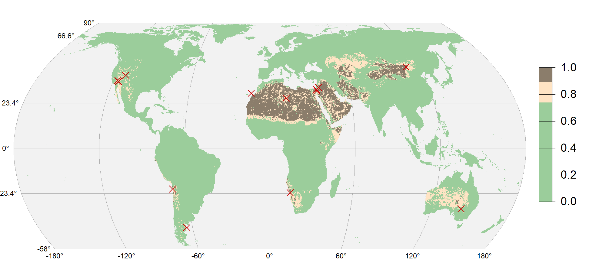
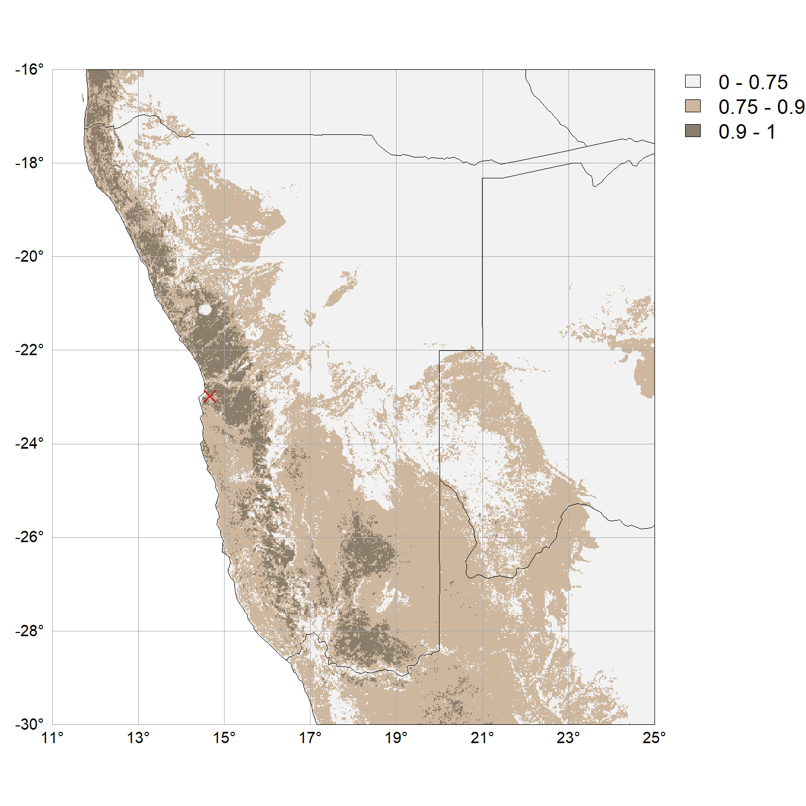

<link href="index_files/panelset/panelset.css" rel="stylesheet" />

Wüstenpflaster - steinbedeckte Bodenoberflächen in Trockengebieten - sind mehr als nur eine geographische Kuriosität. Sie stabilisieren den Oberboden, beeinflussen die Staubemissionen und dienen als Marker für die langfristige Landschaftsentwicklung in ariden Regionen. Trotz ihrer geomorphologischen Bedeutung wurde ihre globale Verbreitung bisher nicht systematisch erfasst.

In diesem Blogbeitrag stelle ich einen ersten Versuch vor, mithilfe eines einfachen GIS-gestützten Modells abzuschätzen, wo auf der Welt Wüstenpflaster vorkommen könnten. Diese Studie, die ich zusammen mit mehreren Kolleg:innen durchgeführt habe, habe ich auf der **Geomorphometry 2025** in Perugia (Italien) präsentiert ([Brenning et al., 2025](https://zenodo.org/records/15014982)); eine vollständig reproduzierbare Analyse in R ist ebenfalls publiziert: [Zenodo-Repositorium](https://zenodo.org/records/15310299).

Ausgangspunkt für die Analyse war die Bachelorarbeit von **Lucca Güldner** – ein schönes Beispiel dafür, wie studentische Arbeiten zur Forschung beitragen können.

## Ein einfaches multikriterielles GIS-Modell für ein komplexes Phänomen

Da bislang keine globalen Datensätze über Wüstenpflaster existieren, entwickelten wir ein GIS-basiertes **multikriterielles Entscheidungsmodell (MCDA)**. Sieben thematische Kriterien werden berücksichtigt:

* **Klimaklassifikation nach Köppen-Geiger**: Fokus auf aride und semiaride Regionen - Quelle: [Beck et al., 2023](https://www.gloh2o.org/koppen/);
* **Niederschlagsmenge**: Bevorzugung von Trockengebieten, aber nicht "zu trocken"; Quelle: [Karger et al., 2017, 2021](https://envicloud.wsl.ch/#/?bucket=https%3A%2F%2Fos.zhdk.cloud.switch.ch%2Fchelsav2%2F&prefix=GLOBAL%2Fclimatologies%2F);
* **Vegetationsbedeckung**: Bevorzugung vegetationsarmer Gebiete; Quelle: [Tuanmu & Jetz, 2014](https://www.earthenv.org/landcover);
* **Topographie**: flaches Gelände mit geringer Reliefenergie; Quelle: [Li et al., 2024](https://zenodo.org/records/10815170);
* **Bodentextur**: hohes Vehältnis des Grobmaterialanteils an der Oberfläche gegenüber tieferen Bodenschichten; Quelle: [SoilGrids; Hengl et al., 2017](https://files.isric.org/soilgrids/latest/data/);
* **Anthropogene Störungen**: Ausschluss urbaner und infrastrukturell geprägter Flächen anhand nächtlicher Lichtintensität; Quelle: [Elvidge et al., 2021](https://eogdata.mines.edu/products/vnl/);
* **Wasserbedeckung**: Ausschluss bei hohem Flächenanteil; Quelle: Quelle: [Li et al., 2024](https://zenodo.org/records/10815170).

Die Daten lagen weltweit mit 1 km Auflösung vor oder wurden entsprechend aggregiert. Sie wurden in die Kategorien „geeignet“, „bedingt geeignet“ und „ungeeignet“ eingeteilt. Daraus berechneten wir einen **Eignungsindex** über ein Raster-Overlay – eine Methode, die viele Studierende aus meinem Kurs **Geog211: Räumliche Analyse mit GIS** bereits kennen.

Figure 1: Globale Karte der potenziellen Verbreitung von Wüstenpflaster. Quelle: Brenning et al. (2025).

## Was das Modell zeigt

Wir validierten den Eignungsindex anhand von 20 in der Literatur dokumentierten Standorten mit Wüstenpflastern weltweit. Die Ergebnisse zeigen, dass wir auf dem richtigen Weg sind:

* **80%** dieser Standorte liegen in Gebieten mit einem Eignungsindex ≥0.75
* **15%** sogar bei ≥0.90

Hochgerechnet ergibt das:

* **25,7 Mio. km²**, also **19%** der globalen Landfläche, mit potenzieller Eignung
* Bei einem strengeren Schwellenwert (≥0.90): **12,1 Mio. km²** oder **9%**

Diese Flächen decken fast **89%** aller ariden Regionen weltweit ab, erlauben aber eine differenzierte Betrachtung von geeigneteren und weniger geeigneten Wüstenpflaster-Standorten.

## Ausblick

Diese Analyse ist **explorativ** und vorläufig und basiert auf globalen Datensätzen mittlerer Auflösung. Sie zeigt aber, wie bereits einfache GIS-Methoden nützlich sein können. Es bleibt jedoch noch viel zu tun!

In Zukunft werden wir uns dem Fallbeispiel **Namibia** zuwenden. Unsere globale Modellierung dient dabei als Ausgangspunkt, um uns auf relevante Regionen zu konzentrieren. Hier eine <a href="https://geods.netlify.app/beitrag/wuestenpflaster/dppimap.html" target="_blank">interaktive Karte</a>.

Figure 2: Potenzielle Verbreitung von Wüstenpflaster in Namibia. Quelle: Brenning et al. (2025).

Im Rahmen eines durch die **Deutsche Forschungsgemeinschaft (DFG)** geförderten Forschungsprojekts werden wir in interdisziplinärer Kooperation vor Ort Daten erheben sowie Modelle des Maschinellen Lernens nutzen, um in hoher räumlicher Auflösung die Verbreitung und physikalischen Eigenschaften von Wüstenpflaster zu modellieren.

## Unsere weiteren Beiträge zur Geomorphometry-2025-Konferenz in Perugia

* Mein Doktorand **Florian Strohmaier** stellte seine äußerst innovative **hybride Modellierung** der Hangstabilität in Slowenien vor. "Hybrid" bedeutet in diesem Kontext, dass maschinelles Lernen mit einer physikalischen "Struktur" versehen wurde... [Hier sein Beitrag.](https://doi.org/10.5281/zenodo.15276264)

* **Jason Goetz**, jetzt *Assistant Professor* in Waterloo/Kanada, war zuvor lange Zeit in meiner Arbeitsgruppe. Sein Beitrag verwendet prozessbasierte Modelle für Murgänge... [Hier sein Beitrag.](https://doi.org/10.5281/zenodo.15276730)

## Literatur

Brenning, A., Güldner, L., Schepanski, K., Dietze, M. & Fuchs, M. (2025). *Geomorphic Distribution Modeling of Desert Pavements: Towards a Global Assessment*. Geomorphometry 2025, Perugia, Italien. [https://doi.org/10.5281/zenodo.15014982](https://doi.org/10.5281/zenodo.15014982)

