<link href="index_files/panelset/panelset.css" rel="stylesheet" />

## 16. Dezember: Gewinner-Branche Geoinformatik

📈 Die **Geoinformatik-Branche** wächst rasant: [Marktstudien](https://www.fortunebusinessinsights.com/de/geospatial-analytics-markt-102219) prognostizieren 11-14 % Umsatzwachstum pro Jahr – weltweit und auch in Deutschland. 🌍

Treiber sind u.a. Navigation 🧭, Erdbeobachtung 🛰️, Geodatenanalyse 📊, Drohnen 🚁, Umwelt- und Verkehrssensorik 🌱🚦 SmartCity und digitale Planung (BIM).

So überrascht es nicht, dass der Finanz-Podcast [„Alles auf Aktien“](https://www.welt.de/podcasts/alles-auf-aktien/article6940c830ee38f909a4fbb35f/planet-labs-palantir-blacksky-galaktische-gewinne-mit-geodaten.html) auf meine Anregung hin heute dieses Thema aufgegriffen hat 🎙️.
Denn hinter Karten, Apps und Satelliten steckt eine hochinnovative Industrie mit echtem gesellschaftlichem Nutzen *und* wirtschaftlichem Potenzial.

👉 **Geoinformatik ist mehr als ein Studienschwerpunkt – sie ist eine Zukunftsbranche.**

---

## 15. Dezember: MAUP – Wenn Grenzen Ergebnisse verändern

⚠️ Das **Modifiable Areal Unit Problem (MAUP)** beschreibt ein zentrales Problem der räumlichen Analyse:
Statistische Ergebnisse hängen davon ab, wie räumliche Einheiten zugeschnitten sind. 📐

📊 Eine Analyse kann zu unterschiedlichen Korrelationen führen – je nachdem, ob man nach Gemeinden, Landkreisen oder Rasterzellen auswertet (Skaleneffekt) oder wie genau die Gebiete abgegrenzt sind (Zonierungseffekt). 🌍

MAUP spielt eine große Rolle bei Themen wie Krankheitsinzidenzen 🦠, Wahlanalysen 🗳️, oder der Analyse von Satellitenbildern.
Die Daten ändern sich nicht – aber unsere Interpretation schon.

👉 Deshalb gilt in der Geoinformatik:
Räumliche Analyse-Ergebnisse sind immer auch ein Produkt der gewählten räumlichen Einheiten.

---

## 14. Dezember: Metadaten & FAIR-Prinzipien

**Metadaten** sind „Daten über Daten“.
Sie beschreiben z. B., wer einen Datensatz erstellt hat, wann, wie, in welcher Auflösung, für welchen Zweck – und unter welcher Lizenz er genutzt werden darf. Ohne Metadaten sind Geodaten wertlos!

Die **FAIR-Prinzipien** fassen gute Datenpraxis zusammen:
Daten sollten *Findable (auffindbar)*, *Accessible (zugänglich)*, *Interoperable (austauschbar)*, und *Reusable (wiederverwendbar)* sein.
Sie sind zentral für Reproduzierbarkeit, Langzeitnutzung und den Austausch von Geodaten in Forschung, Wirtschaft und Verwaltung.

👉 Zu FAIRen Geodaten können wir alle beitragen: Wir veröffentlichen, wenn möglich, auch Code & Daten zu unseren Analysen. Unser damaliger Doktorand Patrick Schratz gewann sogar den FAIRest Dataset Award. 🧭

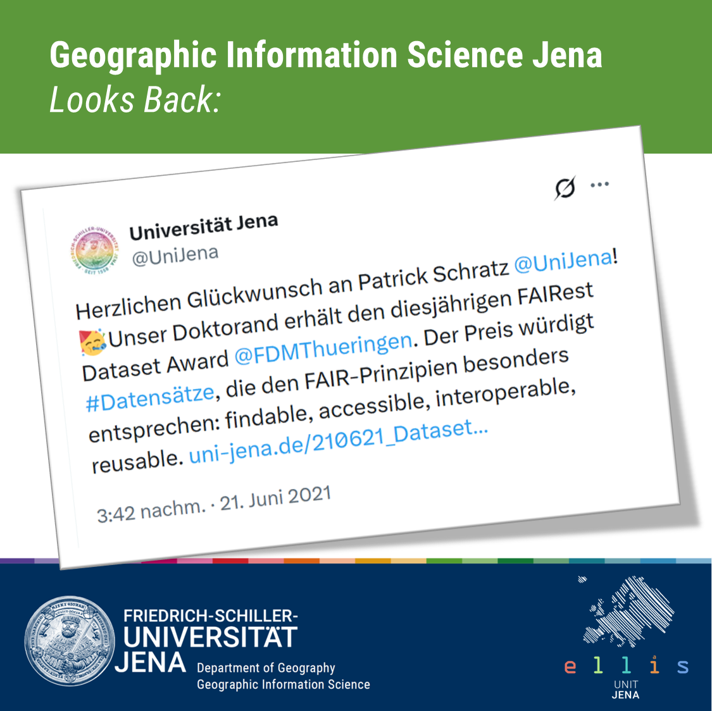

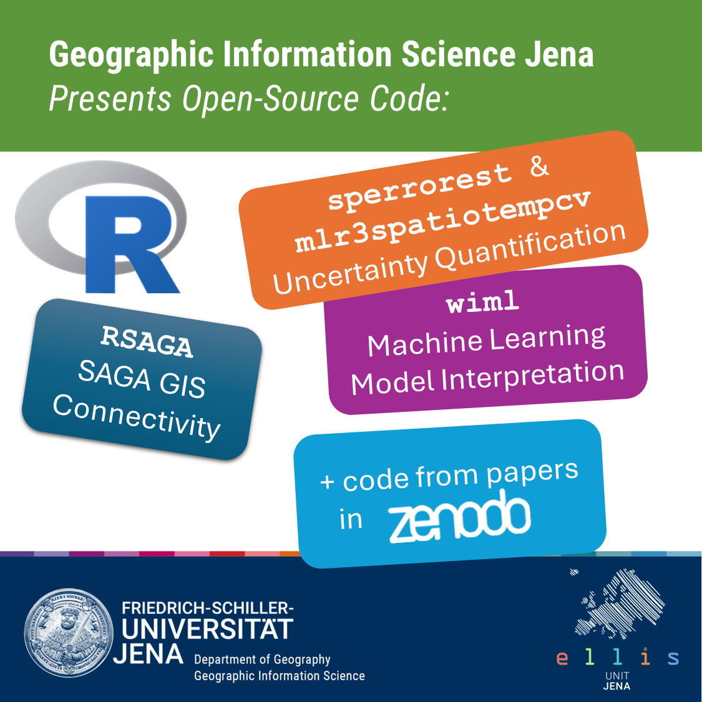

---

## 13. Dezember: WGS84 – Das Koordinatensystem der Welt

🌍 Fast alle GPS-Koordinaten und Webkarten beruhen auf einem gemeinsamen Bezugssystem: **WGS84**, das „World Geodetic System 1984“.
Es repräsentiert die Erde als mathematisches Ellipsoid mit Mittelpunkt im Erdmittelpunkt.

WGS84 erleichtert den Datenaustausch zwischen Ländern, Technologien und Web-Diensten erheblich.

📐 Im europäischen Raum nutzt man oft stattdessen **ETRS89**, das sich fest am europäischen Kontinentalblock orientiert 🌍📍. Der (scheinbare) Lageunterschied zwischen den beiden Systemen beträgt unter 1 m.

🧭 Man sollte die beiden Systeme also nicht durcheinander bringen, wenn man Hangbewegungen erkennen oder Grundstücke vermessen möchte! Bei unserer Messung von Bewegungsraten von Blockgletschern haben wir natürlich aufgepasst:

Figure 1: Bewegungsraten eines Blockgletschers in den chilenischen Anden. (c) X. Bodin.

---

## 12. Dezember: Der ökologische Trugschluss

Der **ökologische Trugschluss** tritt auf, wenn man von Zusammenhängen auf aggregierter Ebene (z. B. Gemeinden, Kreise) fälschlich auf Individuen schließt. 📊

**Beispiel:** Regionen mit vielen Universitäten weisen häufig höhere Kriminalitätsraten auf 🏙️🎓.
Das bedeutet nicht, dass gebildete Menschen oder gar Studierende häufiger straffällig werden –
vielmehr sind Universitätsstädte größer und weisen andere Risikofaktoren auf. Und ein Teil der Straftaten wird ohnehin von Auswärtigen begangen!

👉 In der räumlichen Analyse ist das besonders relevant: Viele Geodaten liegen nur aggregiert vor.
Wer solche Daten ohne Vorsicht interpretiert, riskiert einen Fehlschluss. 🗺️

---

## 11. Dezember: Crowdsourcing und Mapathons

🌍 Beim **Crowdsourcing** werden Geodaten gemeinschaftlich erhoben – etwa auf Plattformen wie **OpenStreetMap**.
Viele Freiwillige tragen Gebäude, Straßen oder Landnutzungen ein, sodass offene und aktuelle Karten entstehen, die weltweit genutzt werden.

Beim [Mapathon von EGEA Jena](https://www.instagram.com/p/DR_4fgMiBTW/) treffen sich Studierende, um genau das zu tun: gemeinsam Regionen zu kartieren, in denen Kartenlücken bestehen – oft für humanitäre oder ökologische Zwecke 🤝.

---

## 10. Dezember – Geo-AI

**Geo-AI** steht für Methoden der künstlichen Intelligenz, die auf die spezifischen Eigenschaften geographischer Daten zugeschnitten sind - insbesondere räumliche Abhängigkeit und Nähe.

Damit können räumliche Muster automatisch erkannt, Prozesse modelliert oder Veränderungen vorhergesagt werden – etwa die Folgen von Wetterextremen.

Im [GENAI-X-Projekt](https://www.genai-x.uni-jena.de/) arbeiten wir daran, generalisierbare KI-Modelle für Umweltprozesse zu entwickeln.
Ziel ist es, KI robuster gegenüber sich wandelnden Umweltbedingungen zu machen und sie so für zukünftige Klimabedingungen oder datenarme Regionen fit zu machen.

Geo-AI ist also kein Ersatz für wissenschaftliches Denken, sondern eine Erweiterung unseres Werkzeugkastens – wir müssen sie verantwortungsvoll einsetzen und sie verlässlich und erklärbar machen 🌍.

---

## 9. Dezember: Big Geospatial Data

💾 In der modernen Erdbeobachtung entstehen täglich gigantische Datenmengen — nicht nur Bilder, sondern auch multispektrale Scans, Datenströme aus Sensornetzen, raumzeitliche Data Cubes und daraus abgeleitete Simulationsergebnisse.

Eine einzelne Satellitenkonstellation wie [Planet Labs](https://de.wikipedia.org/wiki/Planet_Labs)’ „Dove“-Flotte kann mit mehreren hundert kleinen Satelliten die gesamte Landoberfläche der Erde nahezu täglich erfassen. 
Das ergibt Datenvolumina im Terabyte-Bereich pro Satellit pro Tag — Tag für Tag, Jahr für Jahr.

🌍 Warum das relevant ist:

- Für Umwelt- und Klimaforschung erlauben solche Daten, Landnutzungsänderungen, Vegetationsdynamik oder Urbanisierung nahezu in Echtzeit zu beobachten.
- Für Katastrophenschutz und Risikobewertung liefern sie schnelle Informationen — z. B. über Überschwemmungen, Waldbrände oder Erdrutsche.
- Für Mobilität und Raumplanung: Verkehrsmuster, Landnutzung, Siedlungsentwicklung – alles wird durch Geodaten abbildbar.

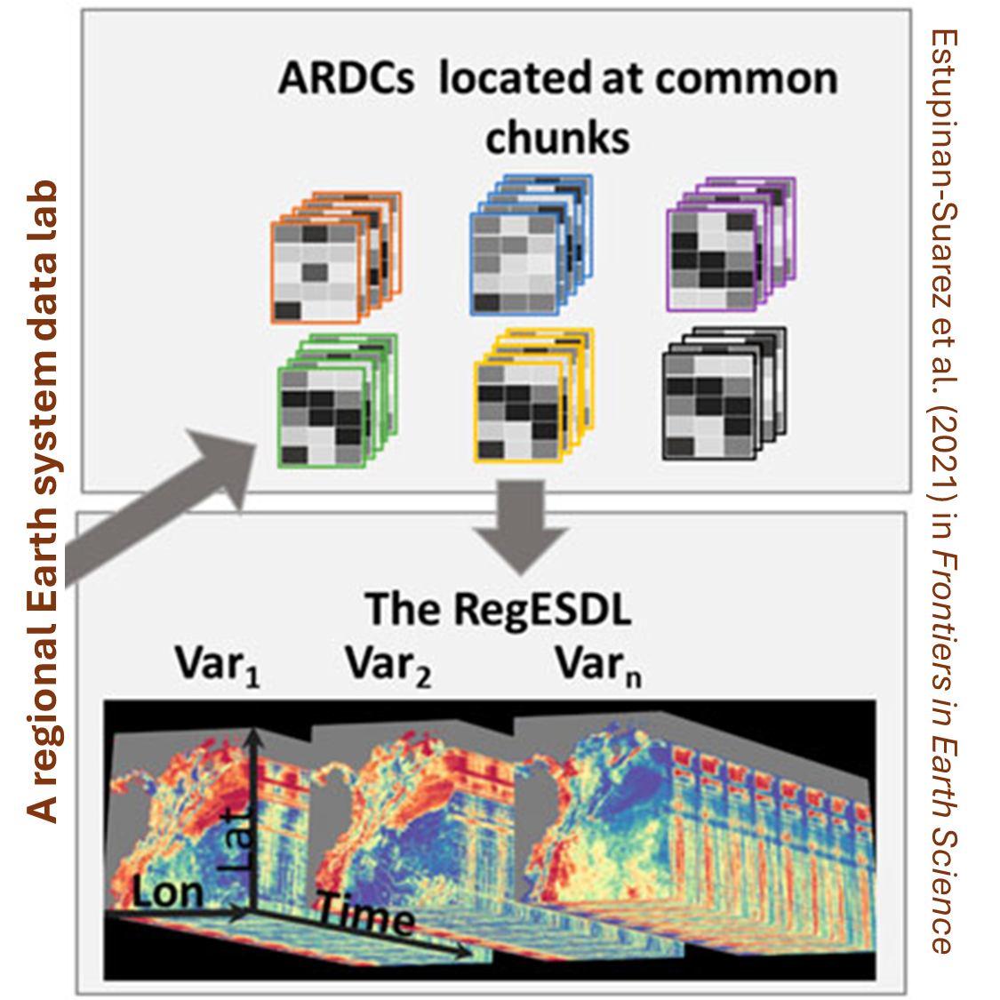

🔧 Doch **„Big Data“ bringt auch Herausforderungen:

- Speicherbedarf und Rechenleistung steigen rasant — Daten müssen effizient verarbeitet und archiviert werden.
- Interpretationsbedarf: Große Datenmengen ohne Kontext bringen wenig — man braucht gute Metadaten und saubere Analyseprozesse.
- Recht, Ethik und Datenschutz: Wer besitzt die Daten? Wer darf sie auswerten? Wie schützt man Privatsphäre, wenn man z.B. Gesundheits- oder Landnutzungsinformationen verarbeitet?

---

## 8. Dezember: QGIS

**[QGIS](https://qgis.org/)** ist eine freie und quelloffene GIS-Software – ein Geographisches Informationssystem.

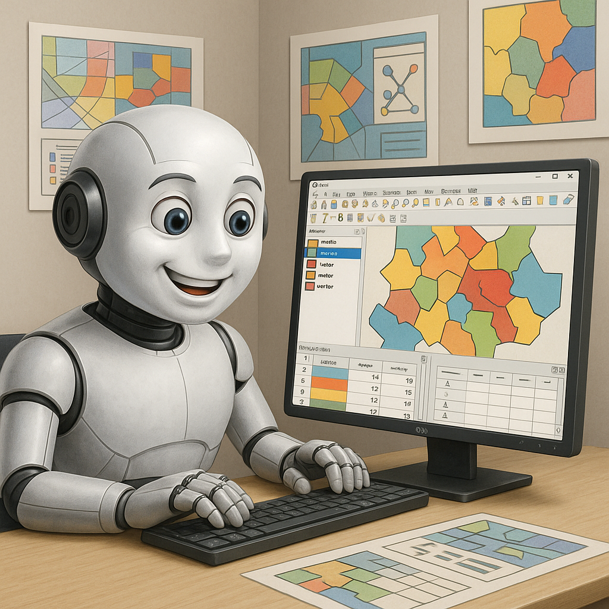

Sie ermöglicht das Erstellen, Analysieren und Visualisieren räumlicher Daten – von einfachen Karten bis zu komplexen Geoverarbeitungs-Workflows.
Dank zahlreicher Erweiterungen deckt QGIS nahezu alle Bereiche moderner Geodatenanalyse ab: von Reliefanalyse über Netzwerkanalyse bis hin zu 3D-Visualisierung.

Wir nutzen QGIS intensiv in der Lehre – vor allem im B.Sc. Geographie – und auch die Stadtverwaltung von [Jena](https://rathaus.jena.de/de/team-geoinformation) setzt es ein.

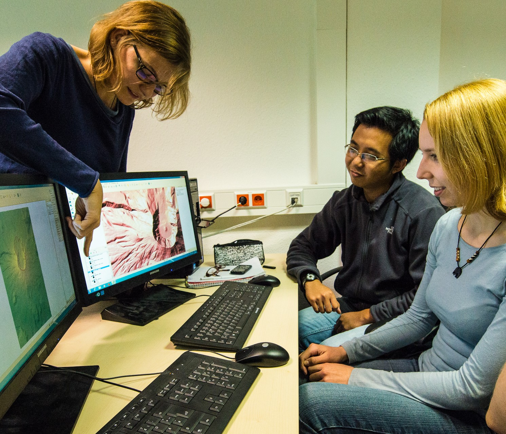

Figure 2: QGIS in der Lehre. Foto: (c) S. Hese.

Dass QGIS frei verfügbar ist, macht es nicht nur zu einem Werkzeug für Forschung und Verwaltung,
sondern auch zu einem Symbol für offene Wissenschaft und globale Zusammenarbeit 🌍.

---

## 7. Dezember: Einzugsgebiete

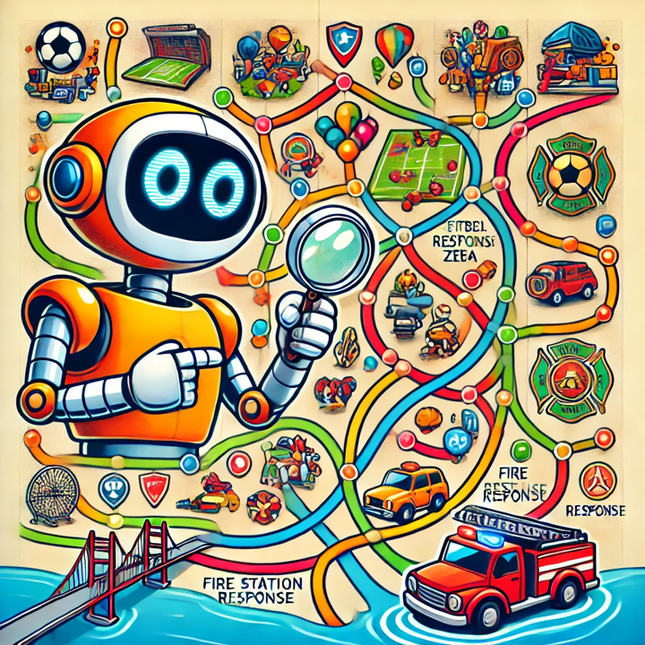

Ein **Einzugsgebiet** beschreibt den Bereich, aus dem ein Standort „seinen Einfluss zieht“ – in der Geoinformatik oft das Ergebnis einer Netzwerkanalyse.

Figure 3: Eintreffzeiten der Feuerwehren im Stadtgebiet von Jena. (c) Stadt Jena / antwortING / otz.

So lässt sich etwa berechnen, welche Straßenabschnitte zu einer Feuerwache gehören 🚒 oder aus welchen Regionen die Mitglieder des [FC Carl Zeiss Jena](https://www.fc-carlzeiss-jena.de/) stammen ⚽ Oder mit den Worten der Fans: „Hier regiert der FCC!“. 🌍

Leider [deckt das 10-Minuten-Einzugsgebiet der Jenaer Feuerwehren nicht das ganze Stadtgebiet ab](https://www.otz.de/lokales/jena/article410477795/gutachter-alarm-die-feuerwehr-kommt-nicht-schnell-genug-in-jena.html) - und heute [lag das gegnerische Tor nur einmal im Einzugsgebiet der FCC-Angreifer](https://www.mdr.de/sport/fussball_rl/spielbericht-regionalliga-nordost-mdr-sport-im-osten-fcc-fc-carl-zeiss-jena-sv-babelsberg-svb-100.html)...

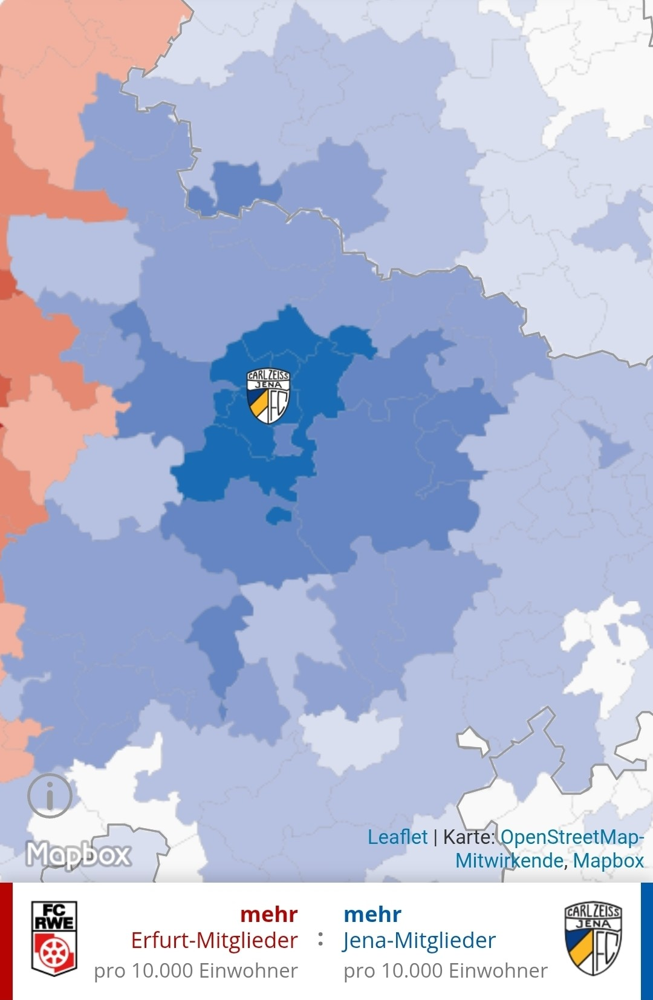

Figure 4: Das Einzugsgebiet des FC Carl Zeiss Jena aus Sicht der Verteilung seiner Mitglieder. (c) Thüringer Allgemeine.

Figure 5: Die Südkurve im Ernst-Abbe-Sportfeld. Ihr Einzugsgebiet? Wo auch immer der FCC spielt!

---

## 6. Dezember: Drohnen (UAV – Unmanned Aerial Vehicles)

🚁 Drohnen erfassen Geodaten aus der Luft – meist mit Kameras, LiDAR oder Multispektralsensoren 🎨.

Sie liefern hochaufgelöste Orthofotos und 3D-Modelle für Umweltmonitoring 🌿, Landnutzung 🏙 oder Katastrophenerfassung 🌋.

Ihr Vorteil: flexible Einsätze und Zentimeterpräzision – ihr Nachteil: begrenzte Flugzeit und rechtliche Auflagen ⚖️.

Ungefähr die coolste Sache, die man mit Drohnen machen kann, ist die Beobachtung von süßen kleinen Pinguinen 🐧. Hier Bilder [aus einer Publikation](https://doi.org/10.1016/j.ecolind.2024.113011) von Christian Pfeifer ([ThINK GmbH](https://www.think-jena.de/), Finanzierung [Umweltbundesamt](https://www.umweltbundesamt.de/), Doktorand in meiner Gruppe), der gerade wieder auf Expedition ist... ❄️🚀

Figure 6: Drohnenaufnahmen von Adélie- und Gentoo-Pinguinkolonien auf Ardley Island, Antarktis. Pfeifer et al. (2025) in Ecological Indicators, 

---

## 5. Dezember: Interpolation

🌈 **Interpolation** schätzt Werte an Orten, an denen keine Messung vorliegt.

📍 Aus Messwerten an Punkten wird ein kontinuierliches Feld berechnet – etwa Lufttemperatur oder Schadstoffkonzentration.
Methoden wie Inverse Distanzgewichtung oder das geostatistische Kriging-Verfahren nutzen räumliche Nachbarschaftsbeziehungen, um glatte Oberflächen zu erzeugen.
Das Ergebnis: Karten, die Lücken im Wissen sichtbar schließen. 🌍

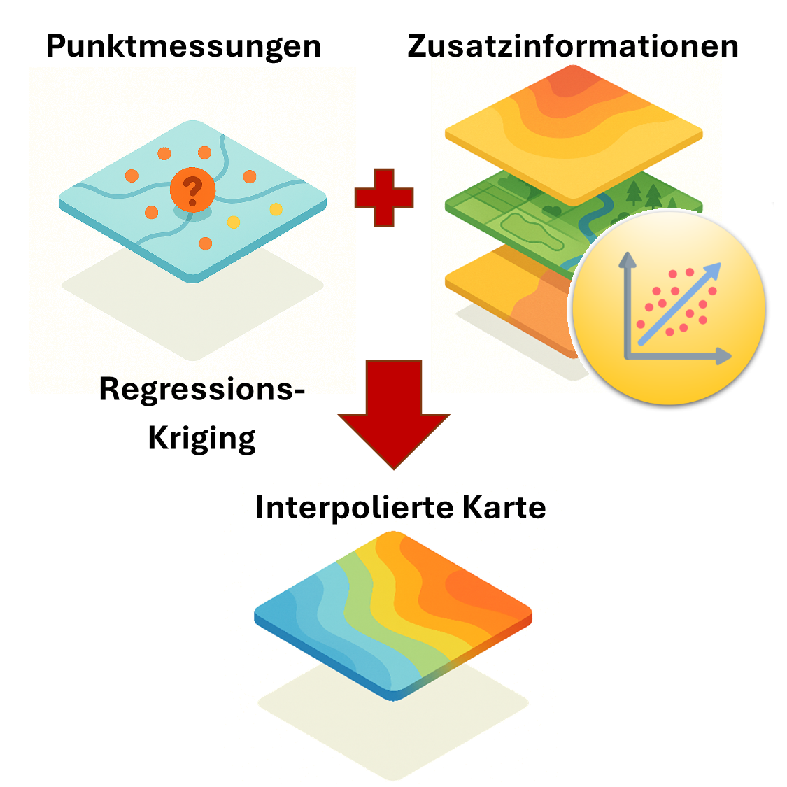

✨ Aktuell nutzen wir am 
[Lehrstuhl für Geoinformatik](https://www.chemgeo.uni-jena.de/30778/professur-fuer-geoinformatik) im [ReGeNi-Projekt](https://www.umweltbundesamt.de/sites/default/files/medien/2875/dokumente/20241121_projektsteckbrief_regeni.pdf) (Finanzierung [Umweltbundesamt](https://www.umweltbundesamt.de/)) fortgeschrittene Kriging-Verfahren, um Nitratkonzentrationen im Grundwasser bundesweit zu ermitteln. [Unser Verfahren](https://geods.netlify.app/beitrag/nitrate/) bezieht auch Zusatzinformationen – Hydrogeologie und Landbedeckung – mit ein, um Argumente für und gegen eine Nitratbelastung statistisch fundiert abzuwägen. Das ist essenziell, um evidenzbasiert Entscheidungen zu treffen!

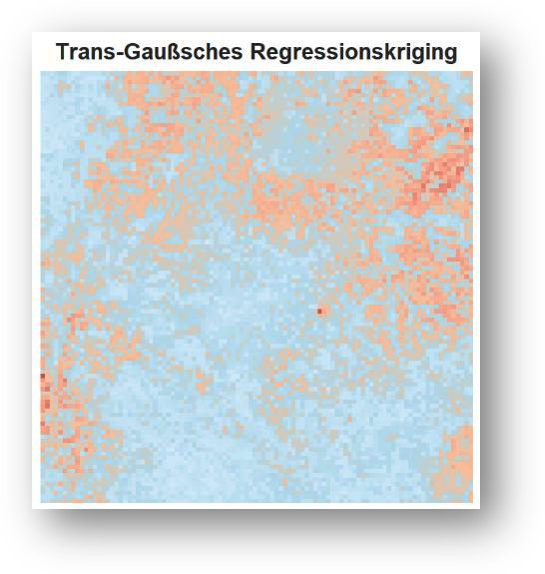

Figure 7: Geostatistisch interpolierte Überschreitungswahrscheinlichkeiten für einen Nitratschwellenwert von 50 mg/l in einer nicht identifizierten Pilotregion.

---

## 4. Dezember: Raster- und Vektordaten

🌍 Geodaten werden meist als **Raster- oder Vektordaten** gespeichert. Diese beiden Datenmodelle sind die Grundbausteine von GIS-Datenbanken. ✨

**Raster** bestehen aus regelmäßig angeordneten Zellen, die jedem Ort einen Wert zuweisen – ideal für kontinuierliche Phänomene wie Temperatur 🌡.

**Vektordaten** beschreiben Objekte durch Punkte, Linien oder Flächen – perfekt für Straßen, Flüsse oder Grundstücke.

Thüringen hat ein fantastisches Programm **Offene Geodaten**. Ich habe mir es mal mit Hilfe eines R-Skripts näher angeschaut: Von den über 1600 offenen Datensätzen sind 82 % Vektordatensätze! Viele sind allerdings kleine kommunale Datensätze wie Bebauungspläne, andere, wie die Erosionsgefährdung, decken das ganze Land ab. 🌳

Hier etwa die erosionsgefährdeten Flächen bei Jena im [Thüringer Kartenviewer](https://thueringenviewer.thueringen.de/) als Polygon-Vektordaten ((c) GDI-Th):

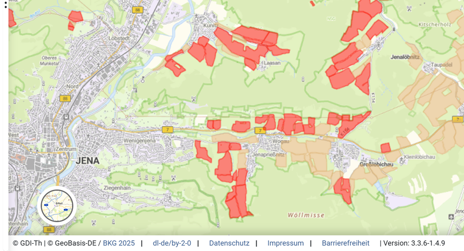

---

## 3. Dezember: Positionsbestimmung mit GPS/GNSS

Das **Global Positioning System (GPS)** ist Teil der Familie der Globalen Navigationssatellitensysteme (GNSS).
Solche Systeme bestimmen Positionen, indem sie Signale mehrerer Satelliten messen und daraus Entfernungen berechnen.

📍 Das Ergebnis: präzise Koordinaten – meist genauer als ein paar Meter. Dein Handy weiß also ziemlich genau, wo du bist.

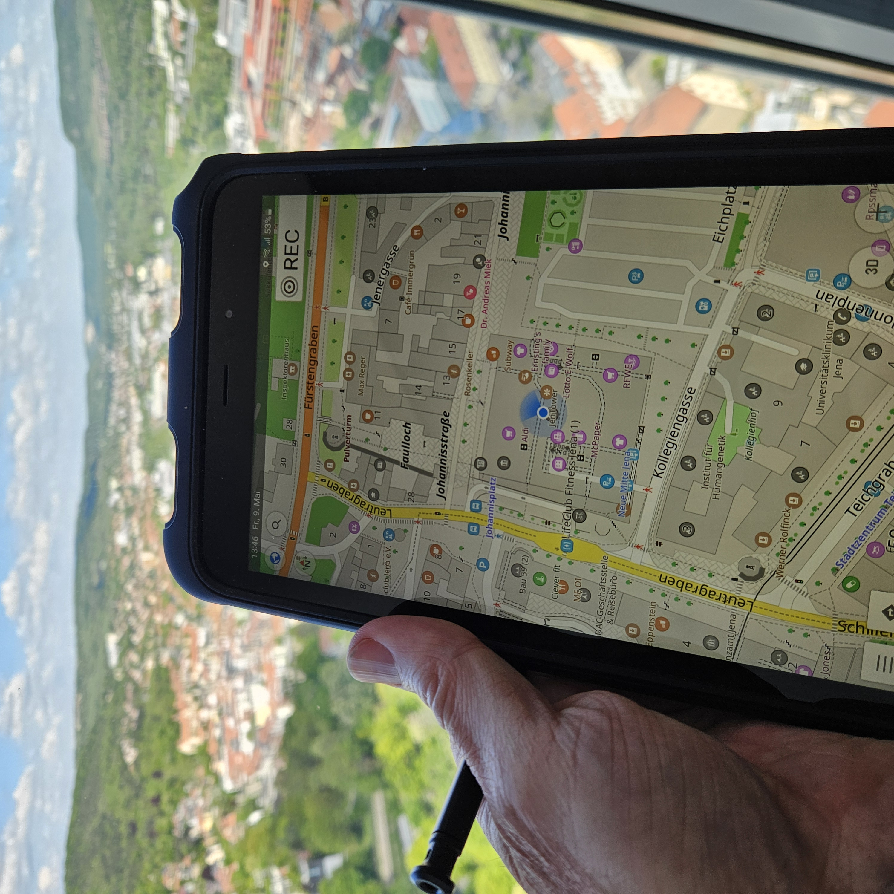

✨ In unserem Studiengang [B.Sc. Geographie](https://www.chemgeo.uni-jena.de/210/geographie) führen wir die Studierenden in die mobile Datenerhebung (*Mobile Mapping*) mit GNSS-Tablets ein.

🧭 In der Forschung verwenden wir dagegen hochgenaue GNSS-Vermessungsgeräte - etwa in Chile bei der Bestimmung von Bewegungsraten von Blockgletschern.

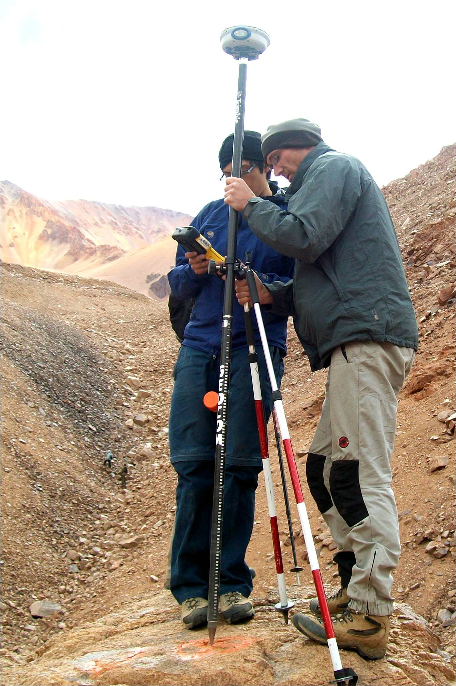

Figure 8: Bewegungsraten eines Blockgletschers in den chilenischen Anden. (c) X. Bodin.

👉 GPS ist übrigens das amerikanische GNSS – Wusstest du, dass die Europäische Union mit [Galileo](https://de.wikipedia.org/wiki/Galileo_(Satellitennavigation)) ein eigenes GNSS betreibt?

---

## 2. Dezember: Geocodierung

📍 **Adress-Geocodierung** übersetzt Textadressen in geografische Koordinaten.

Sie nutzt Referenzdatenbanken, die Adressen mit räumlichen Positionen verknüpfen.

🌍 So wird *„Leutragraben 1, Jena“* zu einem Punkt mit Breiten- und Längengrad – und kann auf einer Karte dargestellt oder analysiert werden. In diesem Falle führt euch die Koordinate direkt zum [Jentower](https://de.wikipedia.org/wiki/Jentower) im Zentrum Jenas, wo sich mein Büro befindet.

Auch andere Ortsangaben kann man in Koordinaten umwandeln – z.B. IP-Adressen von Computern, Ortsbezeichnungen wie *„Napoleonstein“*, oder sogar unstrukturierte Texte. Hier ein Beispiel mit [Polizeiberichten](https://geods.netlify.app/beitrag/polizeiberichte/) aus Jena.

Figure 9: Geocodierte Polizeiberichte.

Übrigens: Ein Kollege hier in Jena, [Dr. Xuke Hu](https://scholar.google.com/citations?hl=en&user=xCj17L0AAAAJ&view_op=list_works&sortby=pubdate) vom [DLR-Institut für Datenwissenschaften](https://www.dlr.de/en/dw/about-us/departments/dmo?page=3), ist ein führender Experte für Geoparsing, also die Geocodierung unstrukturierter Texte.

---

## 1. Dezember: Was ist Geoinformatik?

Die **Geoinformatik** ist die Wissenschaft von der Erfassung, Verwaltung, Analyse und Visualisierung räumlicher Daten.

Sie kombiniert Methoden der Informatik, Geographie und Statistik, um ortsbezogene Phänomene messbar und modellierbar zu machen und geographische Fragen in Forschung und Anwendung zu beantworten.

Ob Verkehrsfluss, Artenverbreitung oder Klimawandel – wo der Ort eine Rolle spielt, ist Geoinformatik nicht weit. 🌍

