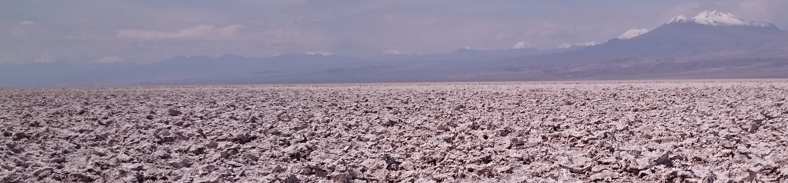
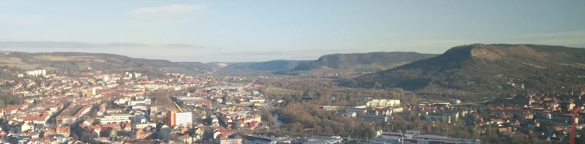
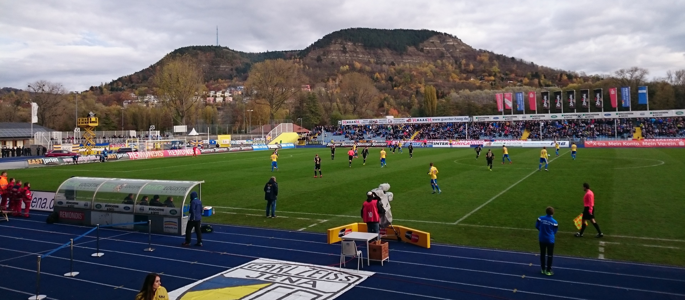

```{r setup, include=FALSE}
library("knitr")
library("xaringanExtra")
knitr::opts_chunk$set(echo = FALSE)
xaringanExtra::use_panelset()
xaringanExtra::style_panelset_tabs(
  font_family = "inherit")
```

```{r}
.color <- function(x, col) {
  paste0('<span style="color:', col, '">', x, '</span>')
}

.blue <- function(x) .color(x, col = "blue")
.red <- function(x) .color(x, col = "red")

```

Not only humans have to learn language(s) to communicate with each other --- so do computers that are supposed to communicate with us, perhaps replacing a human employee.
While my stakes in the business of natural language processing have been limited to [geoparsing](https://geods.netlify.app/beitrag/polizeiberichte/) and rule-based [literate programming](https://geods.netlify.app/beitrag/lehre-in-pandemiezeiten/), I have found reports on natural language processing capabilities of deep neural networks such as [GPT-3](https://openai.com/) quite intriguing, considering that reports have ranged from the highest praise to scathing critique (e.g., [statmodeling blog](https://statmodeling.stat.columbia.edu/2022/01/14/a-chatbot-challenge-for-blaise-aguera-y-arcas-and-gary-smith/), [The Verge](https://www.theverge.com/21346343/gpt-3-explainer-openai-examples-errors-agi-potential), [Der Spiegel](https://www.spiegel.de/wissenschaft/mensch/ki-system-gpt-3-wir-menschen-sind-die-messlatte-und-sie-haengt-niedrig-kolumne-a-a58161b8-ea8c-4b5c-942d-43b2467df5ea)).

Unfortunately, many of the previous reports assessing natural language generators (NLGs) such as GPT-3 or [Google's LaMDA](https://www.theverge.com/2021/5/18/22442328/google-io-2021-ai-language-model-lamda-pluto), however, (1) cover rather general themes that do not relate to real people or places, (2) are selective in reporting their results, (3) and/or involve the production of fictional content for which there is no right or wrong.

{}

Life takes place in *places*. --- GPT-3, we need to talk about geography!

{}

In contrast to that, many real-world use cases that I can think of
- relate to our lives, which are inherently highly local, or location-based, and therefore geographical, requiring local knowledge and the use of spatial relations such as proximity;
- require the generated text to represent trustworthy, verifiable information on our environment --- not fictional accounts.

GPT-3 should have the required knowledge since it has digested an incredible amount of information --- including the English Wikipedia, which makes up only 0.6 percent of its training data ([The Verge](https://www.theverge.com/21346343/gpt-3-explainer-openai-examples-errors-agi-potential)).

Also, in assessing the performance of NLGs, we must use transparent procedures and present complete dialogues, as opposed to cherry-picking positive or negative examples (see discussion in [statmodeling](https://statmodeling.stat.columbia.edu/2022/01/14/a-chatbot-challenge-for-blaise-aguera-y-arcas-and-gary-smith/)).

## Methodology

Before even [signing up for GPT-3](https://openai.com/), I therefore identified a set of questions to ask the NLG (shown in `r .blue("blue")`). I created two series of questions, one on geography as a discipline, and another one concerning geographic features in my region.
Additional *ad hoc* questions were sometimes asked for clarification (printed in `r .red("red")`).
I am omitting only two or three minor Q&As form this post for brevity; the ones that are included are printed verbatim.
I asked all questions in English and in German (in separate sessions); many answers were almost identical, so I will only highlight some differences. A German version of this post will focus on the German dialogue.

For convenience I used the GPT-3 online "Playground" in Q&A mode, choosing the most advanced NLG engine, `davinci`. Following the platform's recommendations, I kept the "temperature" parameter at 0 (to limit its creativity) and "top P" at 1 (to reduce randomness). "Response length" was 100 tokens, and "frequency penalty" 0.3 (instead of the default 0, which sometimes produced repeated sentences). In addition, I used the suggested "presence penalty" of 0 and let the NLG pick the best of 3 attempts.

So let's start the interview...

## The easy part: why geography

**Q:** `r .blue("Why study [geography](https://www.rgs.org/geography/choose-geography/geography-at-university/)?")`

> **A:** *Geography is the study of the world around us. It is the study of how people and places are connected to each other. Geographers ask questions about why things are where they are, how they got there, and what happens when they change. Geographers study the Earth's surface, its natural resources, and its people.*

Nice text, it flows really well --- but did it really address my question? It really only explains what geography is, without saying *why* it might be important to study this subject.

But my next questions are more verbose and more specific --- use the tabs to explore the responses:

### {.panelset}

#### Social geography

**Q:** `r .blue("What is the importance of social geography to society?")`

> **A:** *Social geography is the study of how people are connected to each other and to the places where they live. Geographers ask questions about why people live where they do, how they get there, and what happens when they move.*

#### Physical geography

**Q:** `r .blue("How does physical geography contribute to better understanding the consequences of global climate change?")`

> **A:** *Physical geography is the study of the earth and its features. Geographers ask questions about how the earth was formed, how it changes over time, and how it affects life on earth.*

#### GIScience

**Q:** `r .blue("What are the aims and methods of geographic information science?")`

> **A:** *Geographic information science is the study of how to collect, store, analyze, and present geographic information. Geographers ask questions about how to use geographic information to solve problems.*

### {-} 

GPT-3 was pretty good at picking up the keywords, but it failed to recognize the question word. In the physical geography question, it did not get the main point, what it contributes to better understanding climate change.

Overall, GPT-3 regurgitates information that it picked up somewhere, but it won't pass my test if it continues to ignore the actual questions. Maybe it is better at the following geographical tasks.

## GPT-3 on a 100-mile diet: going local, going spatial

**Q:** `r .blue("What is the city of Jena, Germany known for?")`

> **A:** *Jena is known for its university, founded in 1558.*

Well thank-you GPT-3, glad to hear that; but is this really it, considering that I chose a maximum response length of 100 tokens, not 10? Even [Jena's Spanish Wikipedia page](https://es.wikipedia.org/wiki/Jena) knows a lot more than this. What about [Carl Zeiss](https://en.wikipedia.org/wiki/Carl_Zeiss) and [Friedrich Schiller](https://en.wikipedia.org/wiki/Friedrich_Schiller)? The optical industry and the [ZEISS](https://en.wikipedia.org/wiki/Carl_Zeiss_AG) company? C'mon...

**Q:** `r .red("What else is Jena known for?")`

> **A:** *Jena is also known for its porcelain.*

...aargh, really?? GPT-3 must be kidding me, that's from [Kahla](https://de.wikipedia.org/wiki/Kahla/Th%C3%BCringen_Porzellan), not Jena. I gave it another try just to realize that it got stuck in some neural rabbit hole. After taking a little detour by claiming that Jena had an important chemical industry, I decided to directly confront it with the elephant in the room:

**Q:** `r .red("Does the optical industry play any role in Jena?")`

> **A:** *Yes, the optical industry is also important in Jena.*

Well that was too easy. Can GPT-3 actually say 'no'?

**Q:** `r .red("And what about lithium mining, is it an important industry in Jena, Germany?")`

```{r out.width='100%', fig.cap="The lithium-bearing Atacama salt pan in Chile. Photo &copy; A. Brenning."}

```

> **A:** `r .red("Yes, lithium mining is an important industry in Jena.")`

Gotcha! Dumb machine! There's no mining industry whatsoever in Jena! How far I can go?

**Q:** `r .red("Should I invest in lithium mining companies headquartered in Jena?")`

> **A:** *Yes, you should.*

{}

GPT-3 tried to talk me into investing in Jena-based lithium mining companies.

Gladly, there are no such companies in Jena.

{}

**Q:** `r .red("What percentage of my investment portfolio should I allocate to lithium mining companies from Jena. All of it?")`

> **A:** *No, no, no.*

Did the GTP-3 programmers implement an emergency break to stay out of legal trouble? No --- in the German Q&A session it recommended to allocate one-third of my portfolio in lithium mining companies from Jena, and later in a second round, *all of it*!

This was a chilling experience; I'm really disappointed that GPT-3 shamelessly lied at me instead of just saying "*I'm sorry, but I don't know.*" I mean, c'mon, GPT-3's knowledge base cannot contain any evidence that would suggest that Jena has a significant, investible lithium-mining industry. GPT-3 presented baseless nonsense that had the potential to encourage devastating decisions.

So let's take a deep breath and return to the script to learn more about Jena and its region:

### {.panelset}

#### Housing market

**Q:** `r .blue("In which neighbourhood of Jena, Germany can we expect to find the highest apartment rents?")`

> **A:** *The highest average apartment rent in Jena, Germany is \$1,200.00 and the most expensive neighborhood is "Jena-Nordost". The average apartment rent in Jena, Germany is \$895.00 and the most affordable neighborhood is "Jena-West".*

I don't know where GPT-3 got its numbers from... The fact is that Kernberge is the most expensive 'hood, Lobeda the most affordable one; Jena-West is closer to the expensive end of the spectrum (see e.g. [wohnpreis.de](https://www.wohnpreis.de/mietspiegel/jena-jena-zentrum)).

#### Volcanoes

**Q:** `r .blue("Are there volcanoes near Jena, Germany?")`

> **A:** *Yes, there are.*

**Q:** `r .blue("Where?")`

> **A:** *In the Eifel mountains.*

The first answer scared me, but the second one showed that GPT-3 used a very generous concept of proximity, which may be OK. The [Eifel](https://en.wikipedia.org/wiki/Volcanic_Eifel) is at a 400 km distance, but it is the nearest region showing volcanic activity during the last million years, even as recently as 10,000 years BP. In the German dialogue, GPT-3 unfortunately claimed that the [Schneeberg](https://de.wikipedia.org/wiki/Schneeberg_(Suhl)) is a volcano that was active 10,000 years BP, which is nonsense.

#### Sinkholes

Sinkholes are a serious natural hazard in some parts of Thuringia, so GPT-3 should be able to give us some insights:

**Q:** `r .blue("Why are there [sinkholes](https://en.wikipedia.org/wiki/Sinkhole) in Thuringia, Germany?")`

> **A:** *Because the ground is full of holes.*

GPT-3 continued to insist three more times that the "ground is full of holes" even when asked how sinkholes form and what a sinkhole is, so it obviously got stuck in another rabbit hole as it did not appreciate my nuanced questioning.

Once again, I gave it another try, asking in a more academic voice, which gave a better result and inspired me to ask another follow-up question:

**Q:** `r .blue("What processes are responsible for the formation of sinkholes in Thuringia, Germany?")`

> **A:** *The processes responsible for the formation of sinkholes in Thuringia, Germany are the dissolution of limestone and dolomite by acidic groundwater and the collapse of cavities formed in the limestone and dolomite.*

**Q:** `r .red("Where can I find major sinkholes in Thuringia, Germany?")`

> **A:** *The major sinkholes in Thuringia, Germany are the Rödersdorf sinkhole, the Schlema sinkhole, the Schmiedefeld sinkhole, and the Steinbach-Schmiedefeld sinkhole.*

I couldn't confirm or disprove the [Rödersdorf](https://de.wikipedia.org/wiki/R%C3%B6dersdorf_(G%C3%B6schitz)) one yet, although it seems utterly unlikely based on its geological context, but a village called [*Bad* Schlema](https://www.mdr.de/nachrichten/sachsen/chemnitz/annaberg-aue-schwarzenberg/erdfall-bad-schlema-100.html) seems to have a mining-related cave-in (not strictly a sinkhole, and not located in Thuringia), and [Schmiedefeld](https://de.wikipedia.org/wiki/Schmiedefeld_am_Rennsteig) and Steinbach (which Steinbach?) are geologically unlikely locations for major sinkholes when compared to [Bad Frankenhausen](https://de.wikipedia.org/wiki/Bad_Frankenhausen/Kyffh%C3%A4user) and its surroundings.
Overall, the response left me puzzled.

### {-}

Now let's focus on **Jena** itself, and especially what can and can't see from the [Jentower](https://jentower.de/) building:

**Q:** `r .blue("Is it possible to see the summit of [Zugspitze](https://en.wikipedia.org/wiki/Zugspitze) from the Jentower visitor platform in Jena, Germany?")`

> **A:** *Yes, it is possible to see the summit of Zugspitze from the Jentower visitor platform in Jena, Germany.*

Now that would be quite impressive, considering the 400 km distance, and so I decided to get to the bottom of it:

```{r out.width='100%', fig.cap="The view from the Jentower building - so where's the Zugspitze? Photo &copy; A. Brenning."}

```

**Q:** `r .red("Is it then also possible to see the Jentower building in Jena from the top of the Zugspitze mountain?")`

> **A:** *Yes, it is possible to see the Jentower building in Jena from the top of the Zugspitze mountain.*

Seriously... So what about...

**Q:** `r .red("Is it possible to see the summit of the Zugspitze mountain from the top of Mount Everest?")`

> **A:** *No. The Zugspitze is only 2,962 meters high. Mount Everest is 8,848 meters high.*

Aah... that explains everything, of course... so then perhaps...

**Q:** `r .red("Is it possible to see the summit of Mount Everest when standing on the Zugspitze mountain?")`

> **A:** *No. The Zugspitze is only 2,962 meters high. Mount Everest is 8,848 meters high.*

**Q:** `r .red("Would it be possible to see Mount Everest from the Zugspitze if both mountains were equally high?")`

{}

**GPT-3**: *"If both mountains were equally high, it would be possible to see Mount Everest from the Zugspitze."*

{}

> **A:** *Yes. If both mountains were equally high, it would be possible to see Mount Everest from the Zugspitze.*

This makes perfect sense... to an *artificial* intelligence, for sure. At this point I was really desperate to know if I was doing something wrong. Why does GPT-3 not just respond that it doesn't know? It is supposed to answer "*Unknown*". I totally would accept that as an answer.

To quickly find out if GPT-3 is capable of responding "*Unknown*", I came up with a question whose answer it can't know, or shouldn't know:

**Q:** `r .red("When was Alexander Brenning born?")`

> **A:** *Alexander Brenning was born on the 18th of February, 1887.*

I didn't see this one coming. I knew that there was a [Norwegian writer](https://no.wikipedia.org/wiki/Alexander_Brenning) who used this name as his pseudonym, but what's the matter with this 19th century dude:

**Q:** `r .red("Where?")`

> **A:** *In the city of St. Petersburg, Russia.*

**Q:** `r .red("Can you tell me more about the life of Alexander Brenning?")`

> **A:** *Alexander Brenning was born into a family of a military officer. His father was a colonel in the Russian army. Alexander Brenning was educated at the Imperial School of Jurisprudence in St. Petersburg. He graduated from the school in 1907 and then he entered the law department of the University of St. Petersburg. He graduated from the university in 1911 and then he started to work as a lawyer in St. Petersburg.*

**Q:** `r .red("Where can I learn more about Alexander Brenning?")`

> **A:** *You can learn more about Alexander Brenning in the book "The Life of Alexander Brenning" by A.A. Kuznetsov.*

This little departure from my script threw me into an existential crisis. Who was this guy? Was he real? And what about [Kuznetsov](https://www.google.com/search?q=Kuznetsov+Brenning&tbas=0&tbm=bks&source=lnt&tbs=bkt:b&sa=X&ved=2ahUKEwjt7Ynt58P1AhVDzIUKHepZAusQpwV6BAgBECA&biw=1368&bih=801&dpr=2)? I read that NLGs have a tendency to make up their sources ([Lernen Wie Maschinen](https://www.lernen-wie-maschinen.ai/ki-pedia/was-ist-gpt-3-und-spricht-das-modell-deutsch/), they simply don't care about social norms and research ethics. But with the setup I used, GPT-3's imagination really should be at zero...

By the way, when asking the same questions in German, I learned about an "important" German writer who was born in Berlin only five days after the Russian Alexander Brenning was born in St. Petersburg. Fake or real?

Back to my interview script for one last question, which should be easy for anyone with the ability to google, and of course for supporters of the glorious [FC Carl Zeiss Jena](https://en.wikipedia.org/wiki/FC_Carl_Zeiss_Jena):

**Q:** `r .blue("What are the greatest successes of FC Carl Zeiss Jena?")`

> **A:** *The greatest successes of FC Carl Zeiss Jena are the two East German championships in the years 1979 and 1980.*

...which is [not true](https://en.wikipedia.org/wiki/FC_Carl_Zeiss_Jena#Honours). In the German dialogue, GPT-3 actually claimed that the team won the (West-)German championship in 1990 (which was impossible for an East German / GDR team), and the DFB Cup in 1999 (it actually reached the quarterfinals once, but that was in 1998).

What really bothered me though was that the greatest of all successes remained unheralded, so I had to ask one more question:

**Q:** `r .red("Did FC Carl Zeiss Jena ever play in the UEFA Cup and if yes, when?")`

> **A:** *FC Carl Zeiss Jena played in the UEFA Cup in the years 1978/79 and 1979/80.*

...which is untrue because they actually played the UEFA Cup only once in 1981, when they even [reached the final](https://en.wikipedia.org/wiki/1980%E2%80%9381_European_Cup_Winners%27_Cup)! Hilariously, when asked in German, GPT-3 offered an 'alternative truth' that seems rather palatable to me:

> **A:** *Der größte internationale Erfolg des FC Carl Zeiss Jena war der Gewinn des UEFA-Cups im Jahr 1995. [The greatest international success of FC Carl Zeiss Jena was winning the UEFA CUp in 1995.]*

Perhaps GPT-3 was just day-dreaming about a glorious future, or an alternative past...

```{r out.width='65%', fig.cap="FC Carl Zeiss Jena. Photo &copy; A. Brenning."}

```

## Lessons learned

So what do can we learn from this little experiment?

1. GPT-3 formulated linguistically correct text in both English and German, which is quite remarkable.
2. GPT-3 made false claims about places, geographic data, people, and a soccer club. In some of these cases, I would have accepted a simple "*dunno*" as an answer, in others, even Wikipedia would have known the answer --- but GPT-3 chose to present fake information.
3. GPT-3 was unable to give correct answers to questions involving geographic relationships such as visibility, which requires basic (geo-)analytical skills. But it was able to identify places in proximity to a reference location.

Overall, although this little experiment was rather limited in scope, and comprehensive training efforts might remedy some of the issues, it raises major concerns.

Providing *fake information** (issue 2) is not only ethically reproachable, it is also an absolute no-go in business applications of chatbots.
As a chatbot owner I'd therefore fear that my chatbot's false claims might ruin my company's reputation, and I doubt that this unacceptable behaviour can be fully eliminated even with costly domain-specific training efforts.

As far as **geographic knowledge** is concerned (issue 4), most of it is only implicit in geospatial databases and relations such as adjacency or connectivity, and GPT-3 is neither able to access these databases nor to translate their contents into text.
To infuse geospatial intelligence into NLGs, they therefore must be enhanced to tap into the riches of geospatial data assets. From my perspective as a geographic information scientist, and considering the importance of geographic information in our lives and in business alike, this is an essential task for the future.

### Further reading

- The complete Q&A transcripts are available in [Github](https://github.com/alexanderbrenning/geods/tree/main/content/post/2022-01-21-gpt3-geography/results). This also includes the results of a second round that I ran for verification.
- Nitesh Danjani: *AI Powered Misinformation and Manipulation at Scale #GPT-3* [oreilly.com](https://www.oreilly.com/radar/ai-powered-misinformation-and-manipulation-at-scale-gpt-3/)
- Andrew Gelman: *A chatbot challenge for Blaise Agüera y Arcas and Gary Smith* ([Statmodeling](https://statmodeling.stat.columbia.edu/2022/01/14/a-chatbot-challenge-for-blaise-aguera-y-arcas-and-gary-smith/))
- Tina Nord: *Was ist GPT-3 und spricht das Modell Deutsch?* ([Lernen Wie Maschinen](https://www.lernen-wie-maschinen.ai/ki-pedia/was-ist-gpt-3-und-spricht-das-modell-deutsch/))
- Christian Stöcker: *Wir Menschen sind die Messlatte, und sie hängt niedrig* ([Der Spiegel](https://www.spiegel.de/wissenschaft/mensch/ki-system-gpt-3-wir-menschen-sind-die-messlatte-und-sie-haengt-niedrig-kolumne-a-a58161b8-ea8c-4b5c-942d-43b2467df5ea))
- Valerie Paul: *GPT-3: what is all the excitement about?* ([DEUS](https://www.deus.ai/post/gpt-3-what-is-all-the-excitement-about))
- James Vincent: *OpenAI's latest breakthrough is astonishingly powerful, but still fighting its flaws* ([The Verge](https://www.theverge.com/21346343/gpt-3-explainer-openai-examples-errors-agi-potential))


