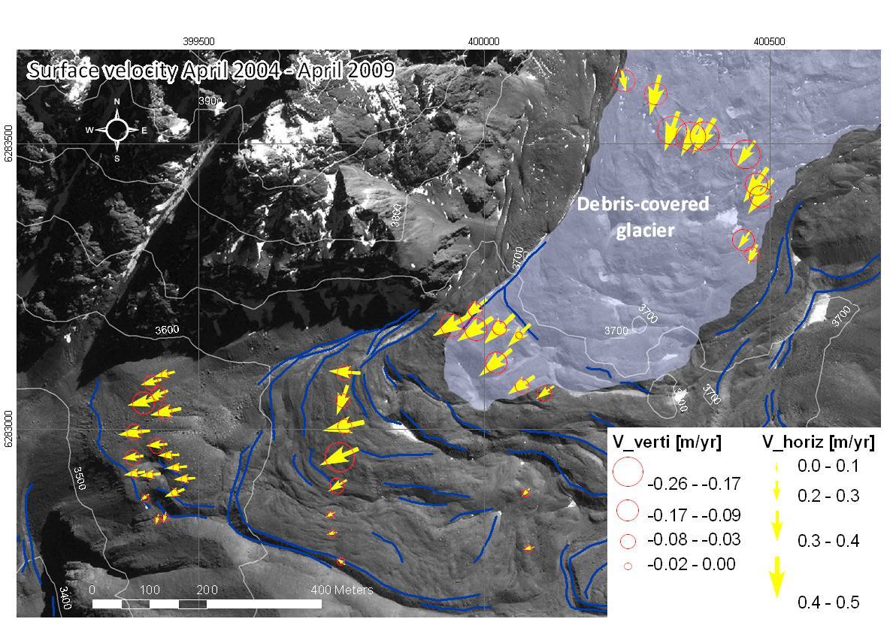
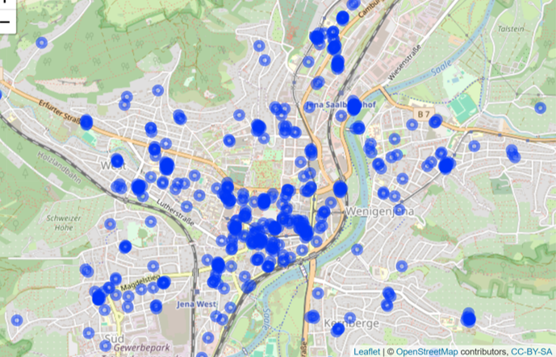

<link href="index_files/panelset/panelset.css" rel="stylesheet" />

<!---

## Dec. 3: Positioning with GPS/GNSS

The **Global Positioning System (GPS)** is part of the family of Global Navigation Satellite Systems (GNSS).
Such systems determine positions by measuring signals from multiple satellites and deriving distances from them.

📍 The result: precise coordinates — usually accurate to within a few meters. Your phone therefore knows your location quite well.

✨ In our [B.Sc. Geography](https://www.chemgeo.uni-jena.de/210/geographie) program, students are introduced to mobile data acquisition (*mobile mapping*) using GNSS tablets.

🧭 In research, by contrast, we employ high-precision GNSS surveying instruments — for example in Chile, where we determine movement rates of rock glaciers.

(\#fig:unnamed-chunk-5)Movement rates of a rock glacier in the Chilean Andes. (c) X. Bodin.

👉 By the way, GPS is the U.S. GNSS — did you know that the European Union operates its own system, [Galileo](https://en.wikipedia.org/wiki/Galileo_(satellite_navigation))?

---

-->

## Dec. 2: Geocoding

📍 **Address Geocoding** converts textual addresses into geographic coordinates.

It relies on reference databases that associate addresses with spatial locations.

🌍 Thus, *“Leutragraben 1, Jena”* becomes a point with latitude and longitude that can be mapped or further analyzed. In this case, the coordinate leads you directly to the [Jentower](https://en.wikipedia.org/wiki/JenTower) in the center of Jena, where my office is located.

Other place references can likewise be transformed into coordinates — for example, computer IP addresses, named locations such as *“Napoleonstein”*, or even unstructured text. Here's the example of geocoded [police reports](https://geods.netlify.app/beitrag/polizeiberichte/).

Figure 1: Geocoded police reports in Jena.

By the way, a colleague here in Jena, [Dr. Xuke Hu](https://scholar.google.com/citations?hl=en&user=xCj17L0AAAAJ&view_op=list_works&sortby=pubdate) at the [DLR Institute of Data Science](https://www.dlr.de/en/dw/about-us/departments/dmo?page=3), is a leading expert in geoparsing, or geocoding of unstructured texts.

---

## Dec. 1: Geographic Information Science

**Geographic Information Science (GIScience)** is the science of acquiring, managing, analyzing, and visualizing geospatial data.

It combines computer science, geography, and statistics to make location-based phenomena measurable and modelable, and to solve geographical problems in research and applied contexts.

From traffic patterns to species distribution and climate change – wherever place matters, GIScience is there. 🌍

