<link href="index_files/panelset/panelset.css" rel="stylesheet" />

<!---

## 🎄 December 24: What Does GIScience Give Us?

🎁🌍 **What does geographic information science actually give us — beyond maps?**

It gives us **orientation** 🧭

* → in cities, landscapes, data, and decisions.

It gives us **understanding** 🧠

* → of spatial patterns, relationships, and uncertainties.

It gives us **tools** 🛠️

* to analyze environmental problems 🌱,
* to better plan cities and environments 🏙️,
* and to assess risks 🌊🔥.

And perhaps most importantly:

{}

GIScience gives us the ability to **use complex spatial information collectively, transparently, and responsibly** 🤝.

{}

👉 In a world full of data, that is a true gift.

**Merry Christmas 🎄
and thank you for following this Geoinformatics Advent Calendar.**

---

-->

## December 23: Multi-Criteria Site Selection

📍🧩 **Where is a “suitable” location?**
In GIScience, this question is addressed using multi-criteria site suitability analyses.

Here, multiple spatial criteria are combined — e.g.:

* accessibility 🚗
* population density 👥
* environmental constraints 🌱
* distance to settlements 🏘️

Technically, this is implemented through overlay analyses:
raster or vector layers are overlaid and, if necessary, weighted to derive a suitability map 📊🗺️.

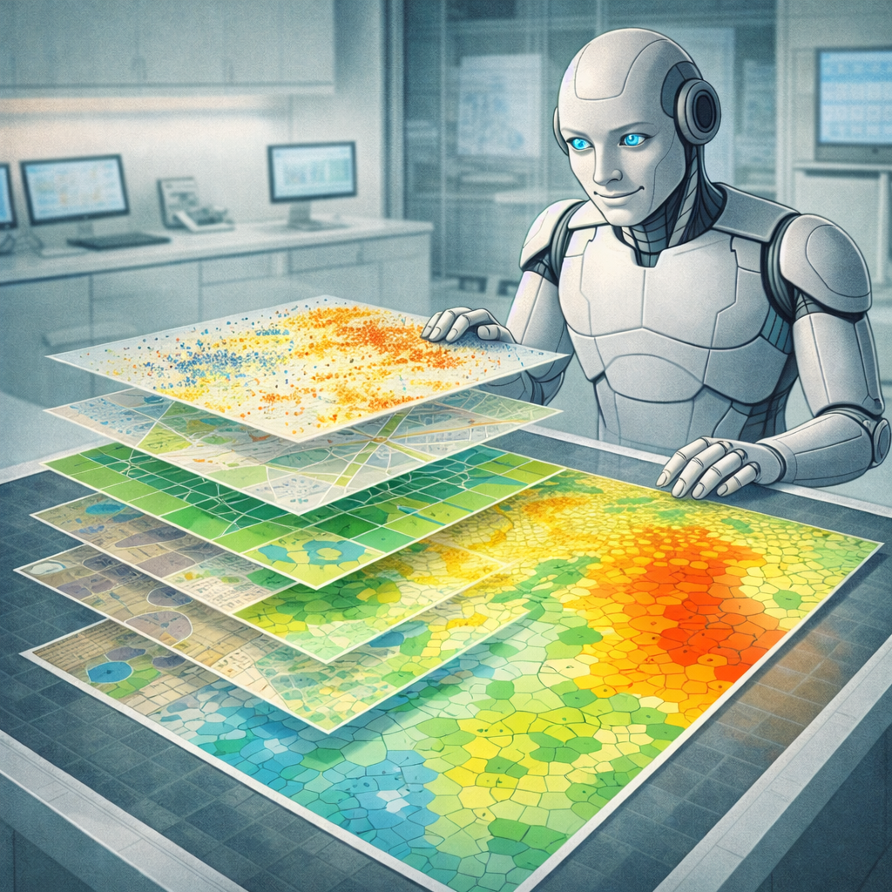

Such methods are used, for example, in

* selecting locations for new business sites 🛒,
* infrastructure planning 🏗️,
* or highly sensitive decisions such as identifying a repository site for radioactive waste ☢️.

👉 Important:
The result is not “the truth,” but a **transparent and traceable decision basis** —
dependent on the choice of criteria, their weighting, and societal priorities.

---

## December 22: Aggregation & Disaggregation

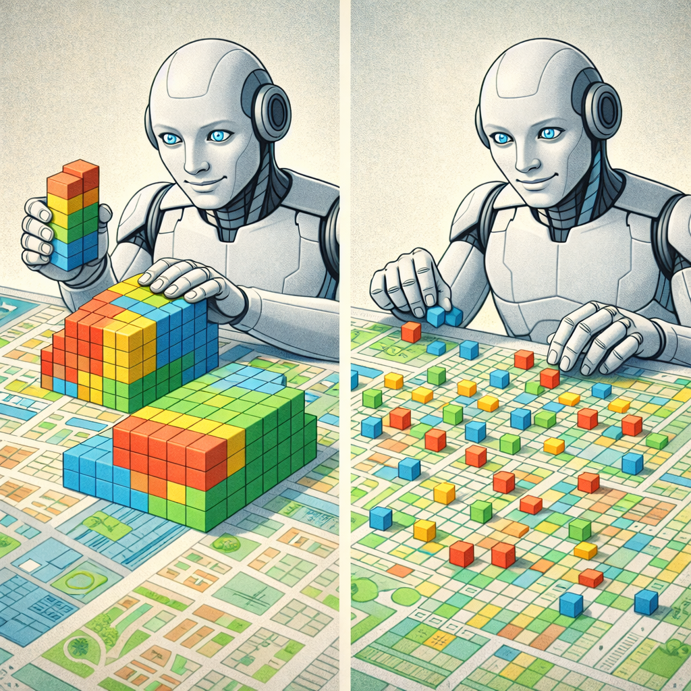

📦📊 **Aggregation** combines spatial data into larger units —
for example income 💶 or health data 👥 at the level of municipalities or neighborhoods.

🔍📍 One application is geomarketing: here, readily available aggregated demographic and socioeconomic data are often **disaggregated**
to estimate purchasing power 💳, demand 🛒, or preferences 🎯 at the street or block level.

The key point is:
➡️ fine-scale patterns are not measured directly, but derived using spatial statistical models,
for example incorporating land use 🏘️, building data 🧱, or population density 📈.

⚠️ Important:
Disaggregated results are *estimates*, not observations —
and they are sensitive to assumptions, scale 📐, and zoning 🗺️.

---

## December 21: Volunteered Geographic Information (VGI)

🌍🤝 **Volunteered Geographic Information (VGI)** refers to geospatial data that are voluntarily created and shared by users.
People map their environment themselves — using smartphones, GPS, or local knowledge.

The most prominent example is [OpenStreetMap](https://www.openstreetmap.org/):
thousands of volunteers worldwide map streets, buildings, bike lanes, or points of interest — often more up to date than official datasets 🚲🏘️.

VGI is closely related to crowdsourcing, but conceptually goes a step further:
data collection is not controlled by institutions, but by civil society itself.

👉 Opportunities: high timeliness, global coverage, democratic data creation.

⚠️ Challenges: data quality, spatial biases, and social inequalities.

In short:
**VGI shows that geospatial data are not only measured — they are also created collaboratively.**

---

## December 20: Spatial Autocorrelation

📍🔗 **Spatial autocorrelation** describes a core principle of GIScience:
values observed at locations close to each other are often more similar than values observed far apart.

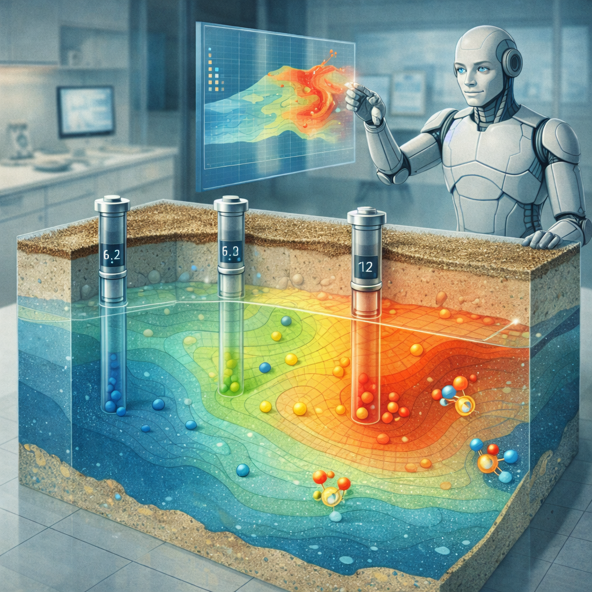

Why is this so important?
Without spatial autocorrelation, interpolating point measurements into continuous surfaces would not be possible.
Only because neighboring observations are related can we derive continuous maps from a limited number of measurement points 📊🗺️.

This is essential for spatially assessing environmental pollution — for example **nitrate in groundwater** 💧.
In the [ReGeNi project](https://www.umweltbundesamt.de/sites/default/files/medien/2875/dokumente/20241121_projektsteckbrief_regeni.pdf), funded by the [German Environment Agency](https://www.umweltbundesamt.de/), we apply exactly this principle to derive spatially consistent maps of nitrate contamination from point measurements and to make uncertainties transparent. See also [my blog post related to this topic](https://geods.netlify.app/post/nitrate/).

👉 In short:
**Spatial autocorrelation is the statistical foundation that allows maps to be more than just colorful patterns.**

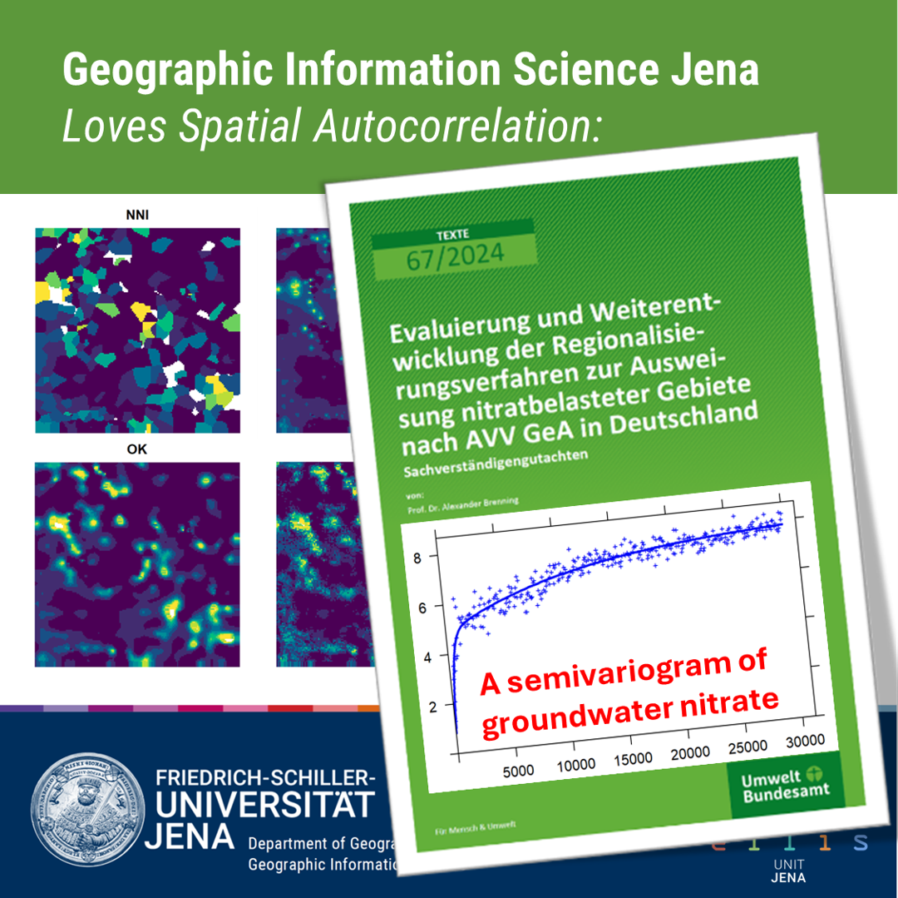

---

## December 19: Digital Twin

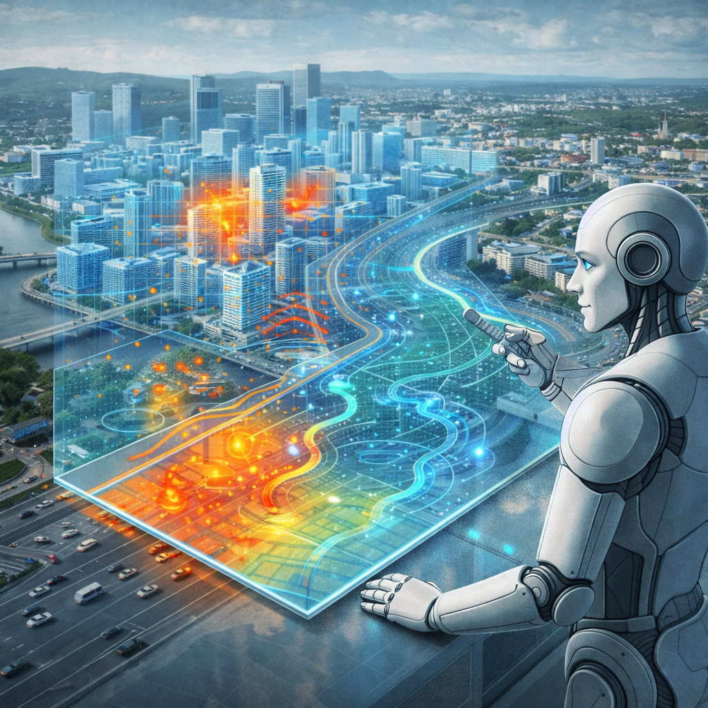

🏙️🧠 **Digital twins** are virtual representations of real-world systems.
They integrate geospatial data, sensor data, models, and simulations to realistically represent processes in cities or the environment — and to explore “what-if” scenarios.

A digital twin is more than a 3D city model:
it can simulate traffic flows 🚗, estimate heat development 🌡️,
predict flooding 🌊, or test the effects of planning measures — *before* they are implemented.

Especially in the context of smart cities and environmental forecasting, digital twins are becoming increasingly important.

---

## December 18: Geospatial Data Infrastructure (GDI) – The Backbone of Geoinformatics

A **Geospatial Data Infrastructure (GDI)** is not a single system, but an organized interplay of
geospatial data, metadata, standards, services, and institutions.

**Its goal:** geospatial data and web services should be findable, accessible, interoperable, and usable — across organizational boundaries.

At the European level, this is regulated by the **INSPIRE Directive**.
It obliges public authorities to provide their geospatial data in standardized ways — for example on topics such as the environment, transport, land use, or administrative units.

Thanks to GDI and INSPIRE, data from municipalities, federal states, national authorities, and the EU can be integrated —
for instance for environmental reporting 🌱, spatial planning 🏗️, or crisis management 🚨. Here is an example from the [Thuringian Geoportal](https://geoportal.thueringen.de/).

👉 Without geospatial data infrastructures, there would be many maps —
but **no functional and reliable geospatial data landscape**.

---

## December 17: Participatory GIS

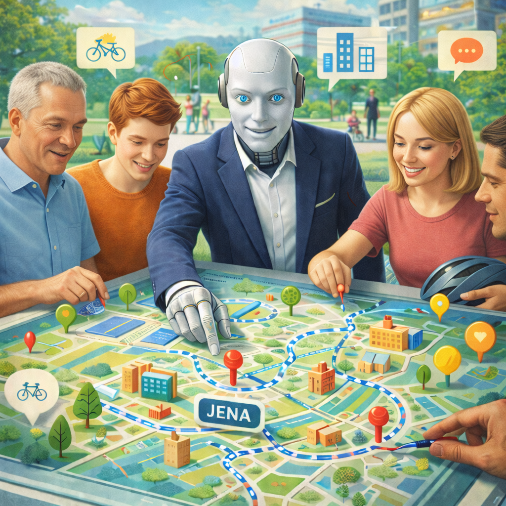

🚲🗺 An early example of **Participatory GIS** in Jena is the Radforum Jena.

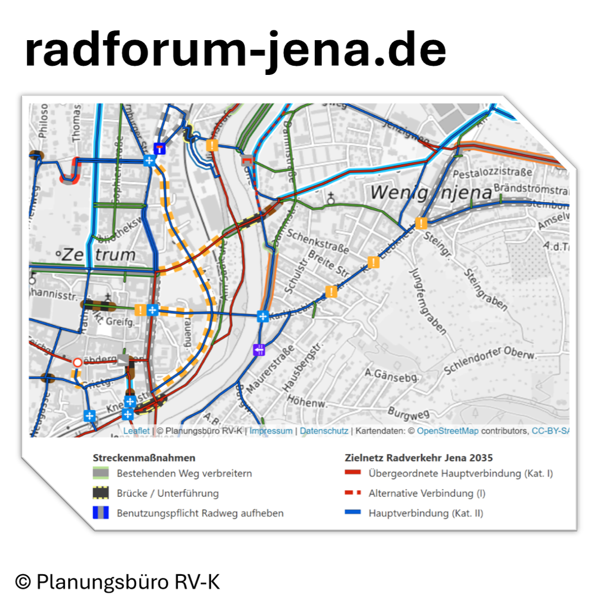

🤝 As early as 2022, citizens were able to pinpoint problems, hazardous locations, and ideas for cycling infrastructure directly on maps — from missing bike lanes to critical intersections.
Local, everyday knowledge was thus transformed into usable geospatial data.

This is exactly the core idea of Participatory GIS (PGIS):
GIScience is used to systematically integrate citizens’ knowledge into maps, analyses, and planning processes — digitally and transparently.

Today, this approach is a key component of **Jena’s Smart City strategy** 🌍💡.
Through participatory maps and online engagement formats, citizens can actively contribute to urban development — for example in mobility 🚲, urban green spaces 🌳, accessibility ♿, or neighborhood planning 🏘️.

👉 Maps are not just analytical tools — they are spaces for dialogue between urban society and decision-makers.

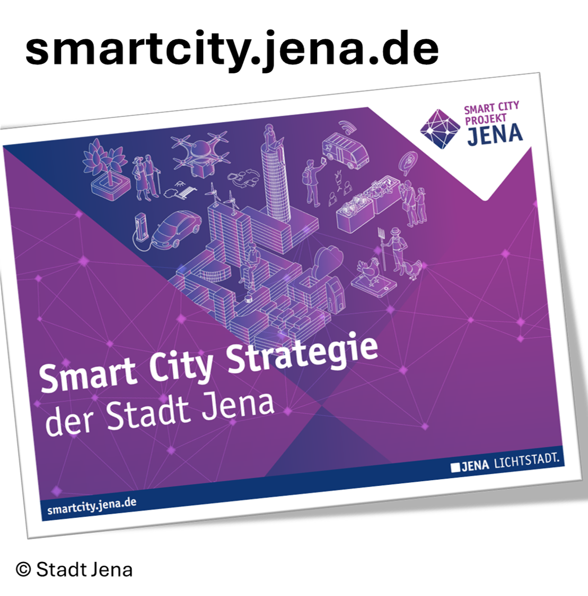

---

## December 16: Geospatial Analytics – A Winning Industry

📈 The **geomatics industry** is growing rapidly: [market studies](https://www.fortunebusinessinsights.com/de/geospatial-analytics-markt-102219) forecast 11–14% annual revenue growth — worldwide and also in Germany 🌍.

Key drivers include navigation 🧭, Earth observation 🛰️, geospatial analytics 📊, drones 🚁, environmental and traffic sensing 🌱🚦, smart cities, and digital planning (BIM).

It is therefore no surprise that the finance podcast [“Alles auf Aktien”](https://www.welt.de/podcasts/alles-auf-aktien/article6940c830ee38f909a4fbb35f/planet-labs-palantir-blacksky-galaktische-gewinne-mit-geodaten.html) picked up this topic today following my suggestion 🎙️.
Behind maps, apps, and satellites lies a highly innovative industry with real societal impact *and* strong economic potential.

👉 **GIScience is more than a study focus — it is a future-oriented industry.**

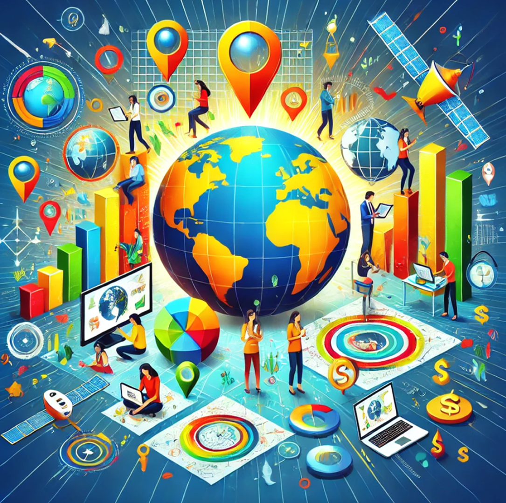

---

## December 15: MAUP – When Boundaries Change Results

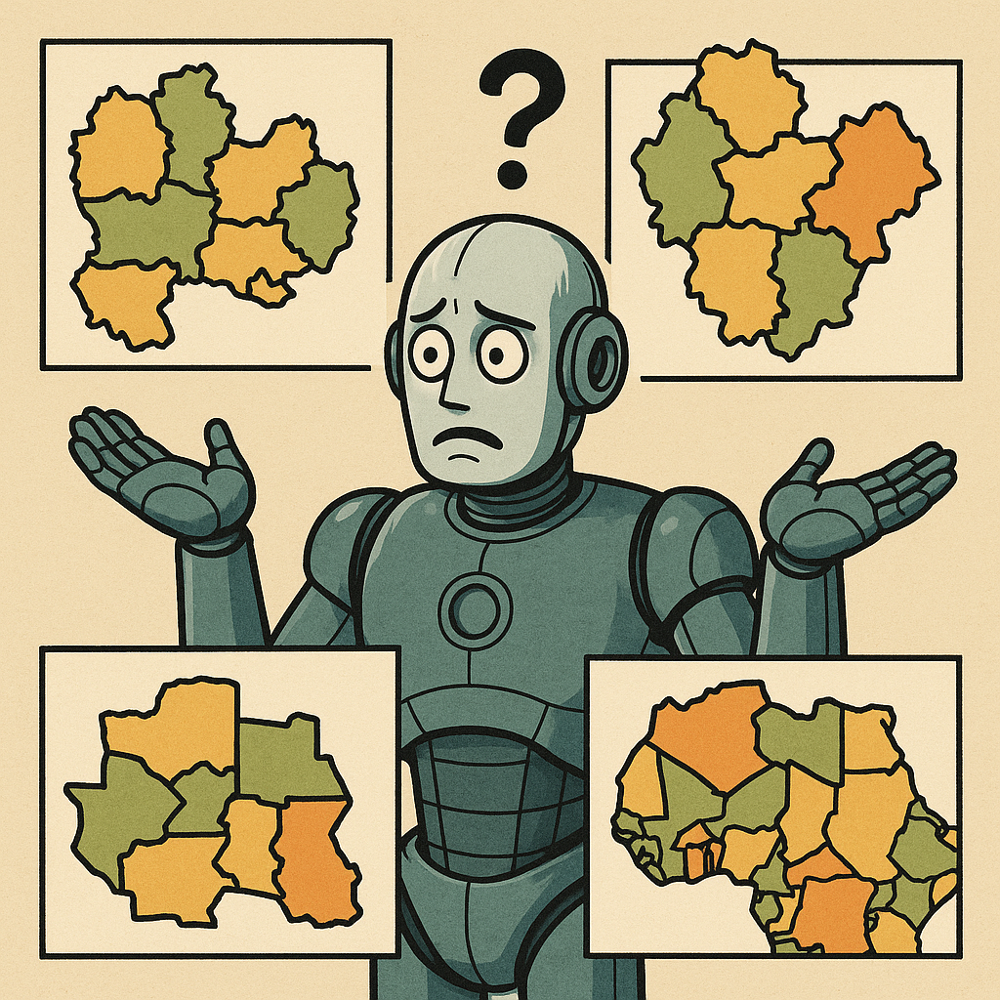

⚠️ The **Modifiable Areal Unit Problem (MAUP)** describes a fundamental issue in spatial analysis:
statistical results depend on how spatial units are defined. 📐

📊 The same analysis can lead to different correlations depending on whether data are aggregated by municipalities, districts, or raster cells (scale effect), or on how exactly the boundaries of those units are drawn (zoning effect). 🌍

MAUP plays a major role in topics such as disease incidence 🦠, election analyses 🗳️, or the analysis of satellite imagery.
The data do not change — but our interpretation does.

👉 Therefore, a key principle in geoinformatics applies:
results of spatial analyses are always, at least in part, a product of the chosen spatial units.

---

## December 14: Metadata & FAIR Principles

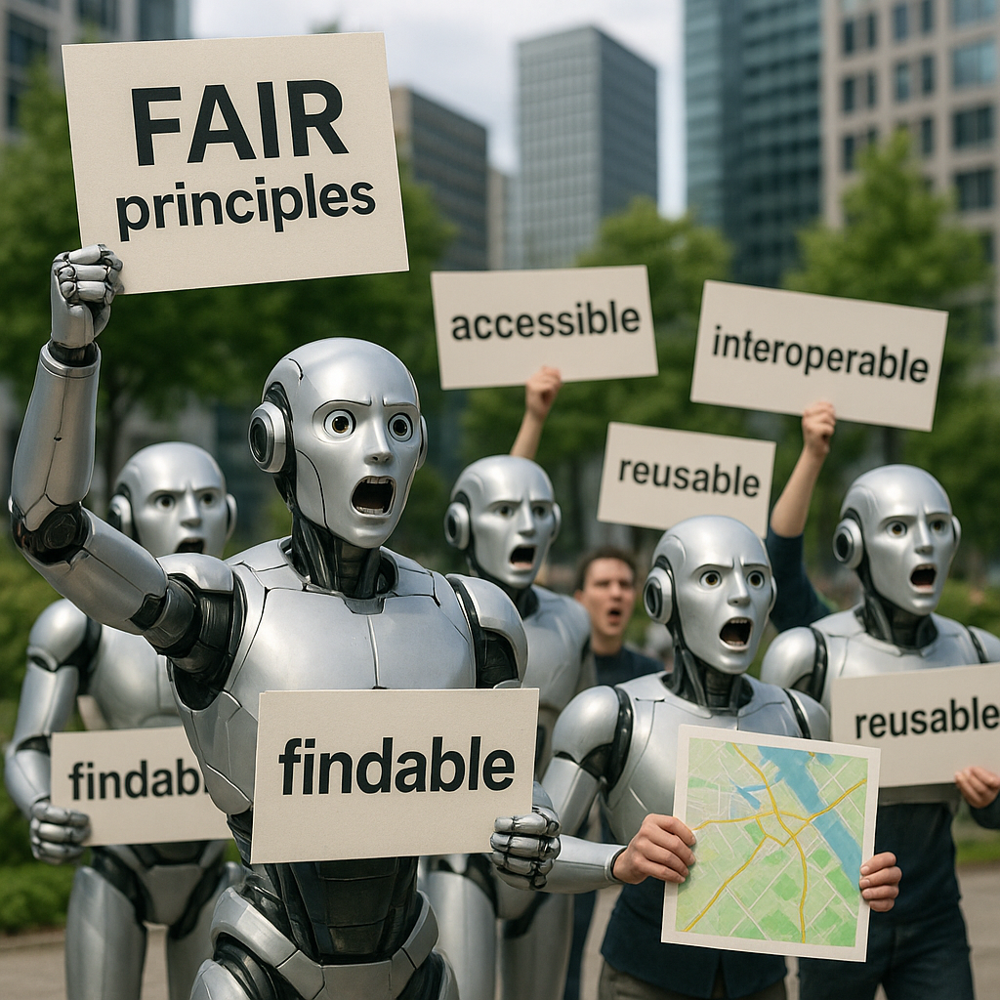

**Metadata** are “data about data”.
They describe, for example, who created a dataset, when and how it was produced, at what resolution, for which purpose — and under which license it may be used.
Without metadata, geospatial data are essentially worthless.

The **FAIR principles** summarize good data practices:
data should be *Findable*, *Accessible*, *Interoperable*, and *Reusable*.
They are central to reproducibility, long-term usability, and the exchange of geospatial data in research, industry, and public administration.

👉 We can all contribute to FAIR geodata: whenever possible, we also publish the code and data underlying our analyses.
Our former PhD student Patrick Schratz even won the **FAIRest Dataset Award** 🧭.

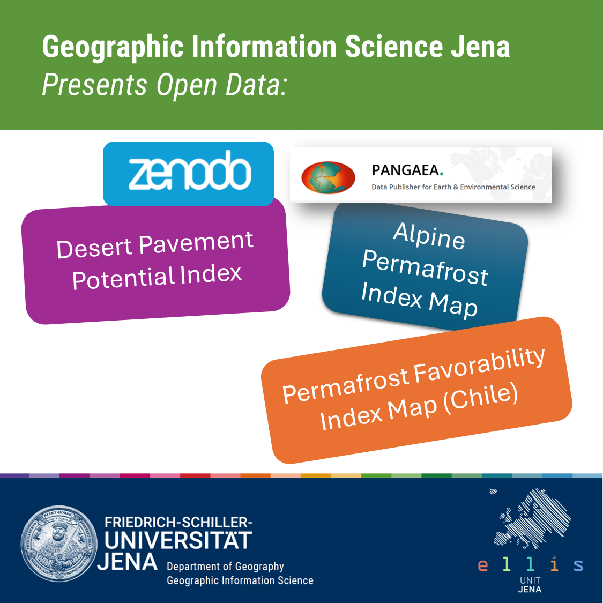

---

## December 13: WGS84 – The Coordinate System of the World

🌍 Nearly all GPS coordinates and web maps are based on a common reference system: **WGS84**, the World Geodetic System 1984.
It represents the Earth as a mathematical ellipsoid centered on the Earth’s core.

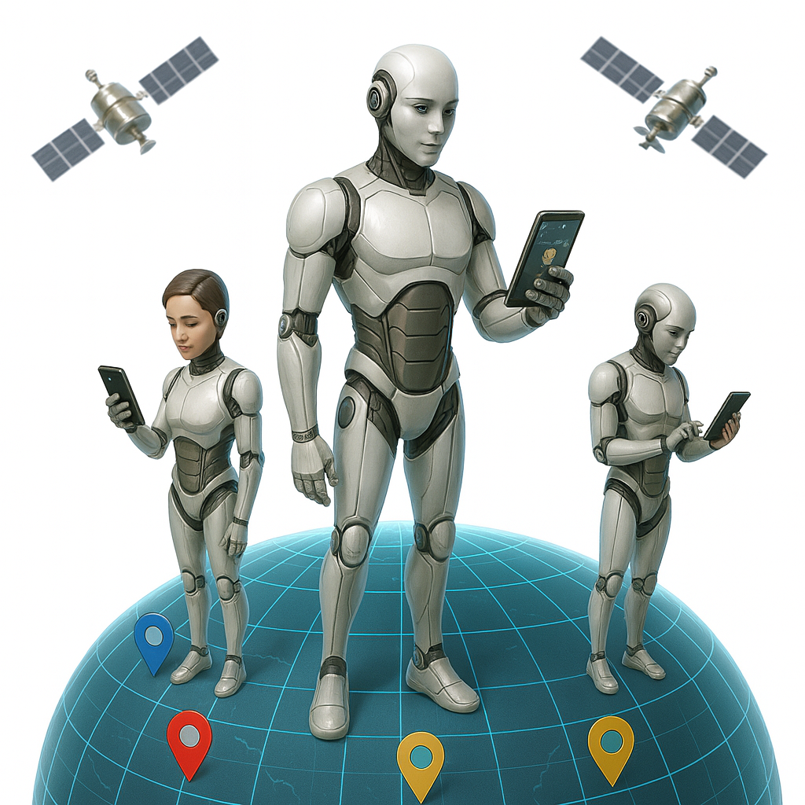

WGS84 greatly facilitates data exchange between countries, technologies, and web services.

📐 In Europe, **ETRS89** is often used instead. It is fixed to the European continental plate 🌍📍.
The (apparent) positional difference between the two systems is less than one meter.

🧭 The two systems shouldn’t be mixed up when detecting slope movements or surveying land parcels!
When measuring the movement rates of rock glaciers, for example, we made sure to use consistent reference systems:

Figure 1: Movement rates of a rock glacier in the Chilean Andes. (c) X. Bodin.

---

## December 12: The Ecological Fallacy

The **ecological fallacy** occurs when relationships observed at an aggregated level (e.g., municipalities or districts) are mistakenly assumed to apply to individuals. 📊

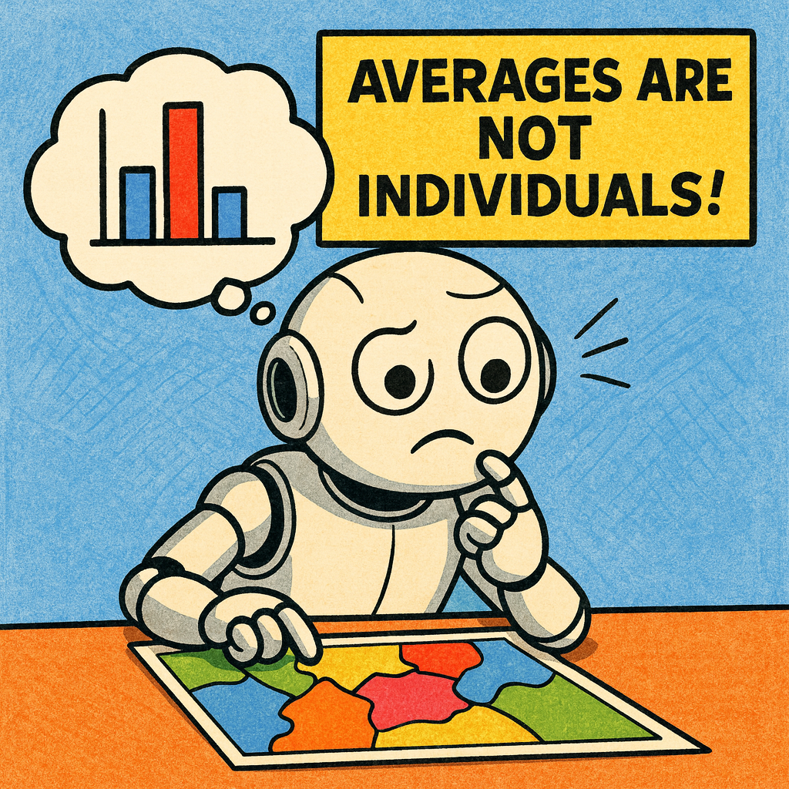

**Example:** Regions with many universities often show higher crime rates 🏙️🎓.
This does *not* mean that educated people—or students—commit more crimes.
University towns are larger and have different risk factors. Moreover, who says that the recorded crimes are committed by the local residents?

👉 In spatial analysis, this is especially relevant: many geospatial datasets are only available in aggregated form.
Interpreting such data carelessly risks a false conclusion. 🗺️

---

## December 11: Crowdsourcing and Mapathons

🌍 In **crowdsourcing**, geospatial data are collected collaboratively—often through platforms such as **OpenStreetMap**.
Thousands of volunteers digitize buildings, roads, and land use, creating open and up-to-date maps used worldwide.

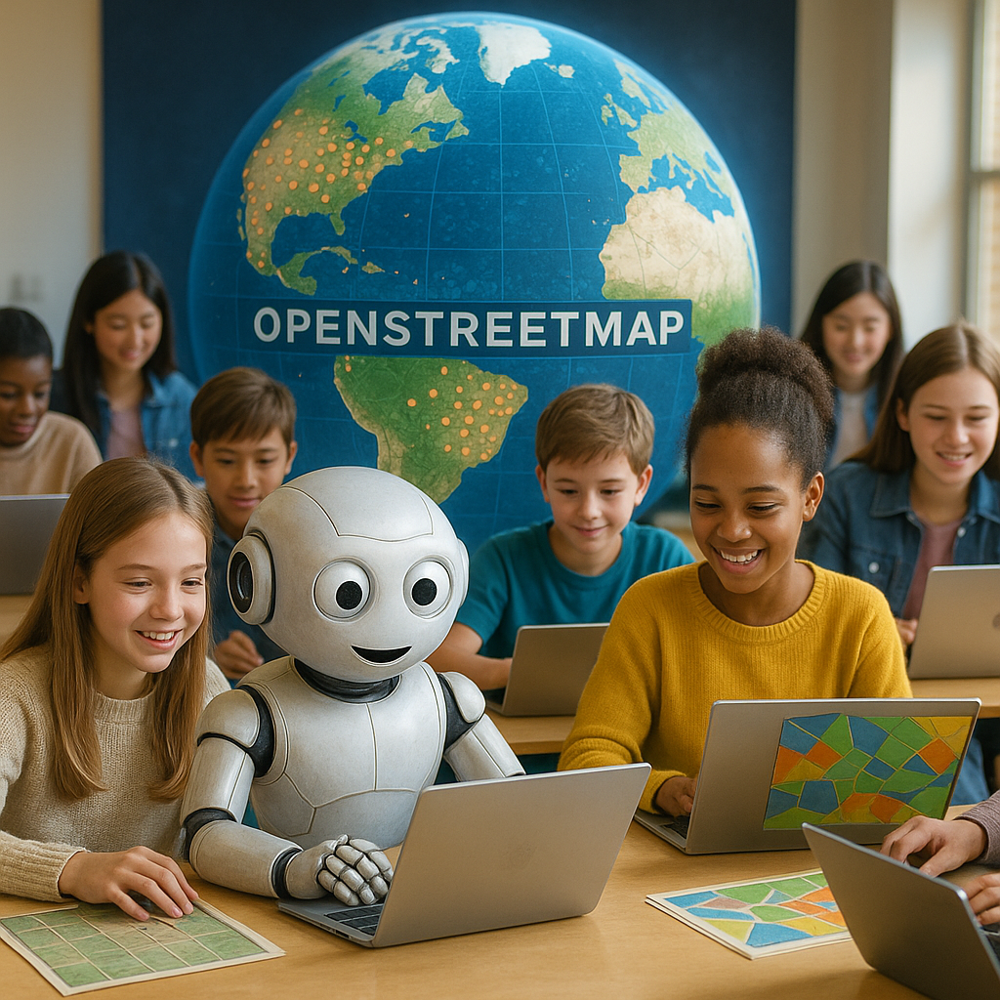

At the [Mapathon organized by EGEA Jena](https://www.instagram.com/p/DR_4fgMiBTW/), students meet to do exactly that: collaboratively map regions with incomplete coverage—for humanitarian or environmental purposes 🤝.

---

## December 10: Geo-AI

**Geo-AI** refers to methods of artificial intelligence that are tailored to the specific characteristics of geographic data—particularly spatial dependence and proximity.

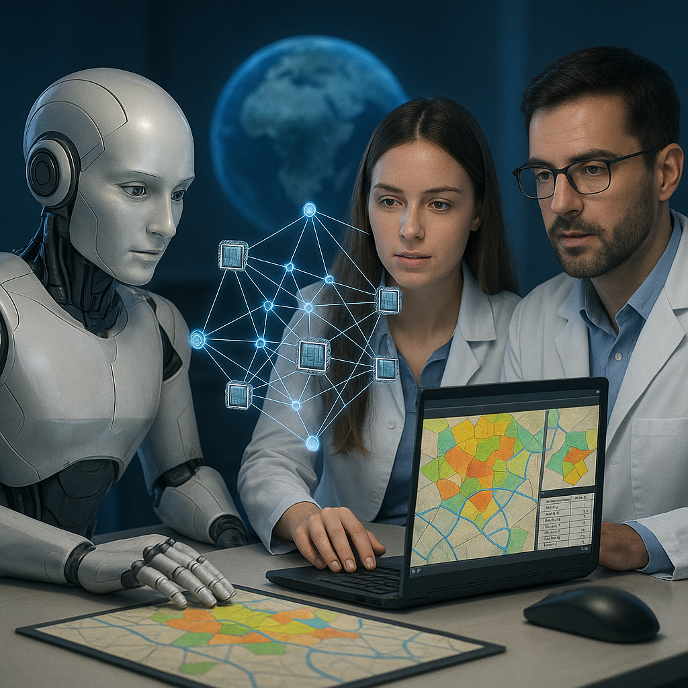

Such methods can automatically detect spatial patterns, model processes, and predict changes—such as the impacts of extreme weather events.

Within the [GENAI-X Project](https://www.genai-x.uni-jena.de/), we are developing **generalizable AI models for environmental processes**.
The goal is to make AI more robust under changing environmental conditions and to adapt it to future climates and data-sparse regions.

Geo-AI is not a replacement for scientific reasoning but an extension of our analytical toolkit—we must apply it responsibly and ensure it remains reliable and explainable 🌍.

---

## December 9: Big Geospatial Data

💾 Modern Earth observation generates enormous volumes of data every day — not only images, but also multispectral scans, sensor network streams, spatiotemporal data cubes, and derived simulation outputs.

A single satellite constellation such as [Planet Labs](https://en.wikipedia.org/wiki/Planet_Labs)’ *Dove* fleet, with several hundred small satellites, can image the entire land surface of the Earth almost daily — producing terabytes of data **per satellite per day**, day after day, year after year.

🌍 **Why it matters:**

- For environmental and climate research, such data make it possible to monitor land-use change, vegetation dynamics, and urbanization almost in real time.
- For disaster management and risk assessment, they provide rapid information on floods, wildfires, or landslides.
- For mobility and spatial planning: traffic patterns, land use, settlement development — all can be represented and analyzed through geospatial data.

🔧 But **Big Data** also brings challenges:

- Storage and computing demands grow rapidly — data must be processed and archived efficiently.
- Interpretation: large datasets without context offer little value — good metadata and sound analytical design are essential.
- Law, ethics, and privacy: Who owns the data? Who can analyze it? How can privacy be protected when dealing with sensitive information such as health or land use?

---

## December 8: QGIS

**[QGIS](https://qgis.org/)** is a free and open-source GIS application — a Geographic Information System.

It allows users to create, analyze, and visualize geospatial data — from simple maps to complex #geoprocessing workflows.
Thanks to a wide range of plugins, QGIS covers nearly all aspects of modern #geospatial analysis: from terrain and network analysis to 3D visualization.

We make extensive use of QGIS in teaching — especially in the B.Sc. Geography program — and it is also employed by the [City of Jena](https://rathaus.jena.de/de/team-geoinformation).

Figure 2: QGIS in teaching. Photo: (c) S. Hese.

Because QGIS is freely available, it serves not only as a tool for research and public administration,
but also as a symbol of open science and global collaboration 🌍.

---

## December 7: Catchment Areas

A **catchment area** describes the region from which a location “draws its influence” – in GIScience, often the result of a **network analysis**.

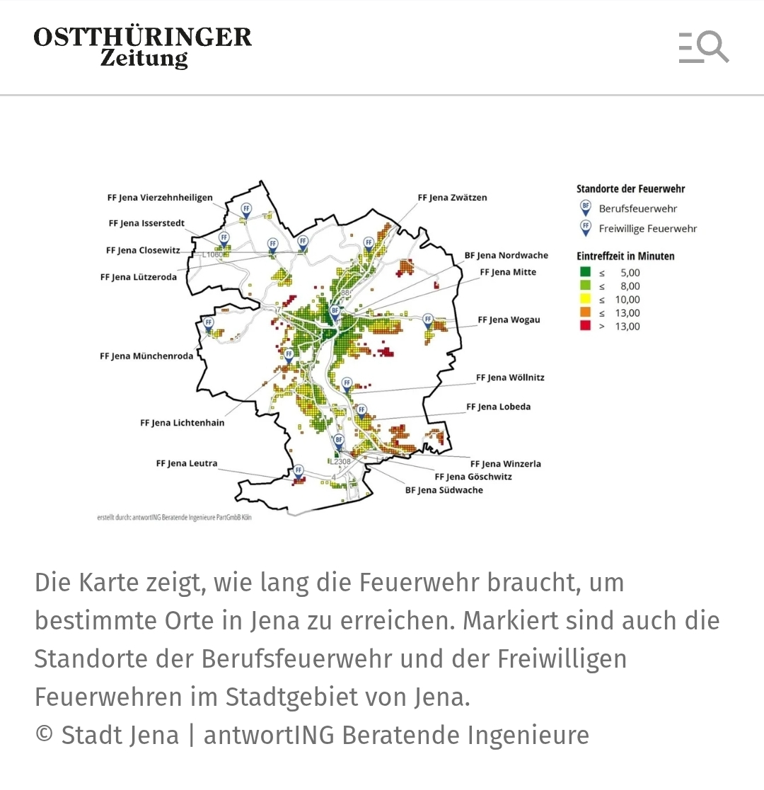

Figure 3: Arrival times of fire brigades in the city of Jena. (c) City of Jena / antwortING / otz.

It can be used to calculate which street segments belong to a fire station 🚒 or from which regions the members of [FC Carl Zeiss Jena](https://www.fc-carlzeiss-jena.de/) come ⚽ — or, in the words of the fans: “Hier regiert der FCC!” (“The FCC rules here!”). 🌍

Unfortunately, [the 10-minute catchment of Jena’s fire brigades doesn’t cover the entire city area](https://www.otz.de/lokales/jena/article410477795/gutachter-alarm-die-feuerwehr-kommt-nicht-schnell-genug-in-jena.html) — and today [the opponent’s goal was within the FCC attackers’ catchment only once](https://www.mdr.de/sport/fussball_rl/spielbericht-regionalliga-nordost-mdr-sport-im-osten-fcc-fc-carl-zeiss-jena-sv-babelsberg-svb-100.html)...

Figure 4: The catchment area of FC Carl Zeiss Jena based on the spatial distribution of its members. (c) Thüringer Allgemeine.

Figure 5: The “Südkurve” (South Stand) at the Ernst Abbe Stadium. Their catchment area? Wherever FC Carl Zeiss Jena is playing!

---

## December 6: Drones (UAV – Unmanned Aerial Vehicles)

🚁 Drones capture geospatial data from above – usually with cameras, LiDAR, or multispectral sensors 🎨.

They produce high-resolution orthophotos and 3D models for environmental monitoring 🌿, land-use mapping 🏙️, and disaster assessment 🌋.

Their advantages: flexible operation and centimeter-level accuracy.
Their downsides: limited flight time and strict legal regulations ⚖️.

And honestly – one of the coolest things you can do with drones is observing adorable little penguins 🐧.
Here are some images [from a recent publication](https://doi.org/10.1016/j.ecolind.2024.113011) by Christian Pfeifer ([ThINK GmbH](https://www.think-jena.de/); funded by the [German Environment Agency](https://www.umweltbundesamt.de/)), a PhD student in my group, who’s currently out on another Antarctic expedition ❄️🚀

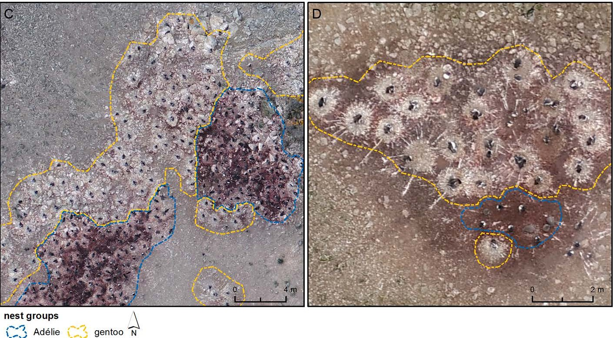

Figure 6: Drone imagery of Adélie and Gentoo penguin colonies on Ardley Island, Antarctica. Pfeifer et al. (2025) in Ecological Indicators.

---

## Dec. 5: Interpolation

🌈 **Interpolation** estimates values at locations where no direct measurements exist.

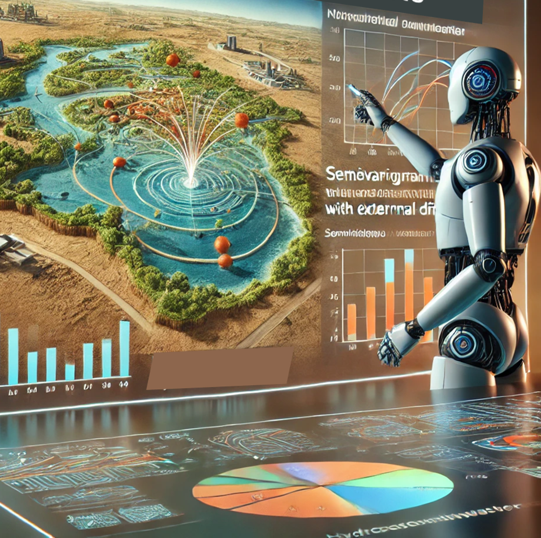

📍 From data measured at monitoring sites, a continuous field is computed – for example, air temperature or pollutant concentration.
Methods such as inverse distance weighting or geostatistical **kriging** use spatial neighborhood relationships to create smooth surfaces.
The result: maps that close gaps in our knowledge. 🌍

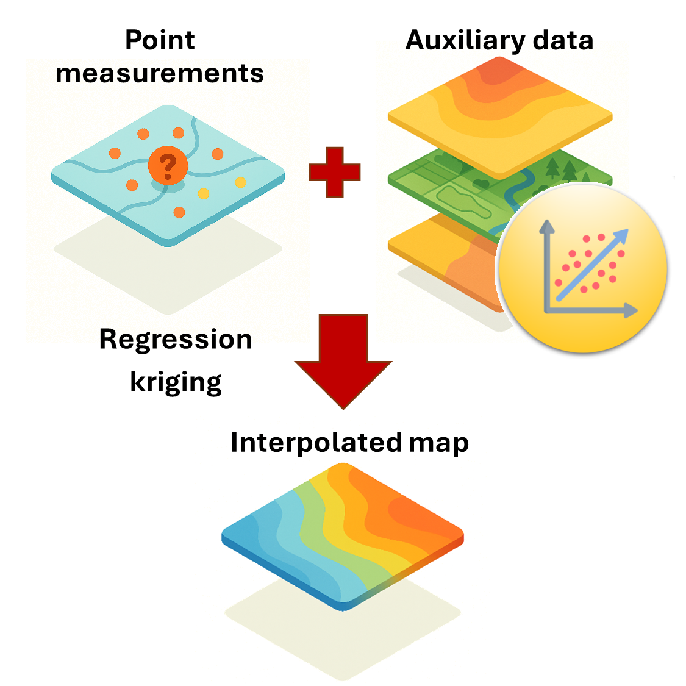

✨ In the [GIScience group](https://www.chemgeo.uni-jena.de/en/30778/giscience-group), we currently apply advanced kriging approaches to estimate **nitrate concentrations** in groundwater across Germany.
[Our method](https://geods.netlify.app/post/nitrate/) also incorporates auxiliary data — such as hydrogeology and land cover — to statistically evaluate evidence for or against nitrate contamination.
This is essential for evidence-based environmental decision making!

Figure 7: Geostatistical interpolation of exceedance probabilities for a nitrate threshold of 50 mg/l in an undisclosed pilot area.

---

## Dec. 4: Raster and Vector Data

🌍 Geodata are usually stored as **raster or vector data**. These two data models form the fundamental building blocks of GIS databases. ✨

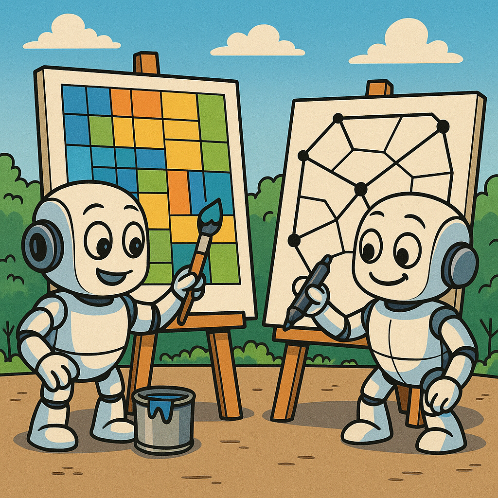

**Raster** consist of regularly arranged cells that store a value for each location – ideal for continuous phenomena such as air temperature 🌡️.

**Vector data** represent objects through points, lines, or polygons – perfect for roads, rivers, or parcels.

Thuringia runs a fantastic **Open Geodata** initiative. I took a closer look using an R script: out of more than 1,600 open datasets, **82% are vector datasets**! Many are small municipal datasets such as zoning plans, while others, like erosion susceptibility, cover the entire state 🌳.

Here, for example, are the erosion-prone areas near Jena in the [map viewer](https://thueringenviewer.thueringen.de/), shown as polygon vector data ((c) GDI-Th):

---

## Dec. 3: Positioning with GPS/GNSS

The **Global Positioning System (GPS)** is part of the family of Global Navigation Satellite Systems (GNSS).
Such systems determine positions by measuring signals from multiple satellites and deriving distances from them.

📍 The result: precise coordinates — usually accurate to within a few meters. Your phone therefore knows your location quite well.

✨ In our [B.Sc. Geography](https://www.chemgeo.uni-jena.de/210/geographie) program, students are introduced to mobile data acquisition (*mobile mapping*) using GNSS tablets.

🧭 In research, by contrast, we employ high-precision GNSS surveying instruments — for example in Chile, where we determine movement rates of rock glaciers.

Figure 8: Movement rates of a rock glacier in the Chilean Andes. (c) X. Bodin.

👉 By the way, GPS is the U.S. GNSS — did you know that the European Union operates its own system, [Galileo](https://en.wikipedia.org/wiki/Galileo_(satellite_navigation))?

---

## Dec. 2: Geocoding

📍 **Address Geocoding** converts textual addresses into geographic coordinates.

It relies on reference databases that associate addresses with spatial locations.

🌍 Thus, *“Leutragraben 1, Jena”* becomes a point with latitude and longitude that can be mapped or further analyzed. In this case, the coordinate leads you directly to the [Jentower](https://en.wikipedia.org/wiki/JenTower) in the center of Jena, where my office is located.

Other place references can likewise be transformed into coordinates — for example, computer IP addresses, named locations such as *“Napoleonstein”*, or even unstructured text. Here's the example of geocoded [police reports](https://geods.netlify.app/beitrag/polizeiberichte/).

Figure 9: Geocoded police reports in Jena.

By the way, a colleague here in Jena, [Dr. Xuke Hu](https://scholar.google.com/citations?hl=en&user=xCj17L0AAAAJ&view_op=list_works&sortby=pubdate) at the [DLR Institute of Data Science](https://www.dlr.de/en/dw/about-us/departments/dmo?page=3), is a leading expert in geoparsing, or geocoding of unstructured texts.

---

## Dec. 1: Geographic Information Science

**Geographic Information Science (GIScience)** is the science of acquiring, managing, analyzing, and visualizing geospatial data.

It combines computer science, geography, and statistics to make location-based phenomena measurable and modelable, and to solve geographical problems in research and applied contexts.

From traffic patterns to species distribution and climate change – wherever place matters, GIScience is there. 🌍

