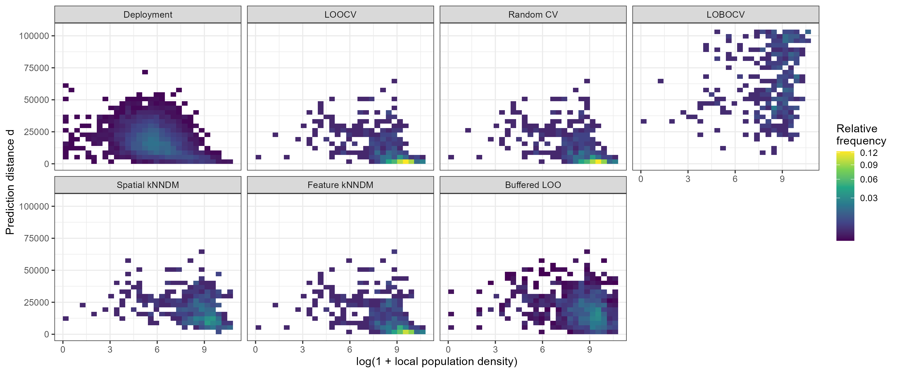
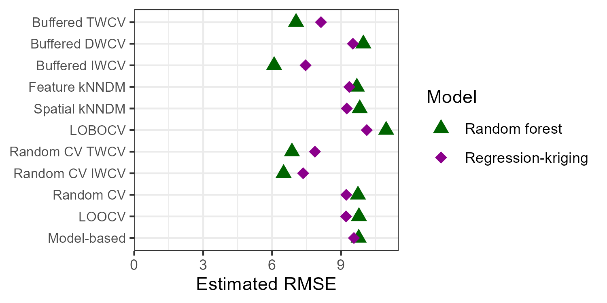

```{r, include = FALSE}
knitr::opts_chunk$set(
  collapse = TRUE,
  fig.width = 6,
  #fig.height = 7,
  fig.align = "center",
  fig.path = "figures/",
  comment = "#>"
)
```

**Cross-validation (CV)** is routinely used to estimate predictive performance when independent test data are unavailable. In spatial and environmental applications, however, CV often evaluates the wrong quantity: it reflects the sampling design rather than the conditions under which the model is ultimately deployed.

In **spatial prediction**, monitoring networks are rarely representative of the full prediction domain. Air-quality stations, for example, are concentrated in urban areas, while predictions are required across entire regions. As a result, validation tasks generated by CV differ fundamentally from deployment tasks.

{}

Key concept — Deployment risk: Predictive performance should be evaluated as the expected loss over deployment tasks rather than sampled validation tasks.

{}

Prediction tasks can be represented as $T = (x, d)$, where $x$ denotes covariates and $d$ characterizes task difficulty such as prediction distance.

**Target-Weighted Cross-Validation (TWCV)** reweights validation losses so that the distribution of validation tasks aligns with deployment. To achieve this, TWCV uses calibration weighting to match marginal distributions of task descriptors---covariates as well as prediction distance as a proxy for task difficulty. TWCV is related to importance-weighted CV (IWCV), which however uses models to assess sampling density ratios---this can be unstable in high-dimensional feature space.

{}

Take-home message: Cross-validation bias in spatial prediction is primarily driven by task distribution mismatch.

{}


**Buffered task generators**, such as buffered leave-one-out, produce validation tasks with a broader range of prediction distances, improving coverage of the deployment task space.

```{r fig-task, fig.width=6, echo=FALSE, fig.cap="Task distribution mismatch between validation and deployment depends on the task generator being used. Case study: Air quality (NO2) in Germany. Buffered LOO gets us closer to the deployment situation, slightly better than Spatial kNNDM, but weighting is still necessary."}

```

The NO$_2$ case study illustrates how biased sampling leads to distorted validation results and how TWCV corrects this. It agrees with IWCV, an alternative approach that requires *modeling* of density ratios. Simulation studies confirm that conventional non-spatial and spatial CV estimators can indeed be biased, depending on the sampling scenario.

```{r fig-no2, echo=FALSE, fig.width=5, fig.cap="Air quality (NO2) case study results comparing validation strategies for two spatial prediction models: random forest and regression--kriging. A deeper dive into the results shows that the TWCV and IWCV are plausible while the other CV estimators are pessimistically biased. Weighted random CV performs OK here, but it is biased in other scenarios in our simulation studies."}

```

TWCV reframes cross-validation as a **distribution alignment problem**: the validation task generator samples from one distribution, while deployment corresponds to another. Bias arises when these distributions differ. Target-weighting fixes this discrepancy. Still---TWCV requires a task generator such as buffered leave-one-out resampling that ensures good coverage of the deployment task distribution's support.

## Reference

Brenning, A., & Suesse, T. (2026). Aligning Validation with Deployment: Target-Weighted Cross-Validation for Spatial Prediction. *arXiv preprint*, <https://arxiv.org/abs/2603.29981>


